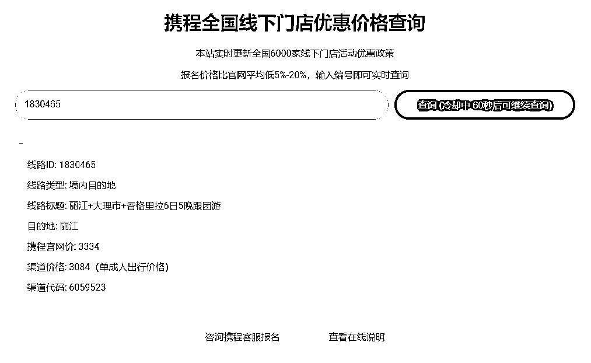
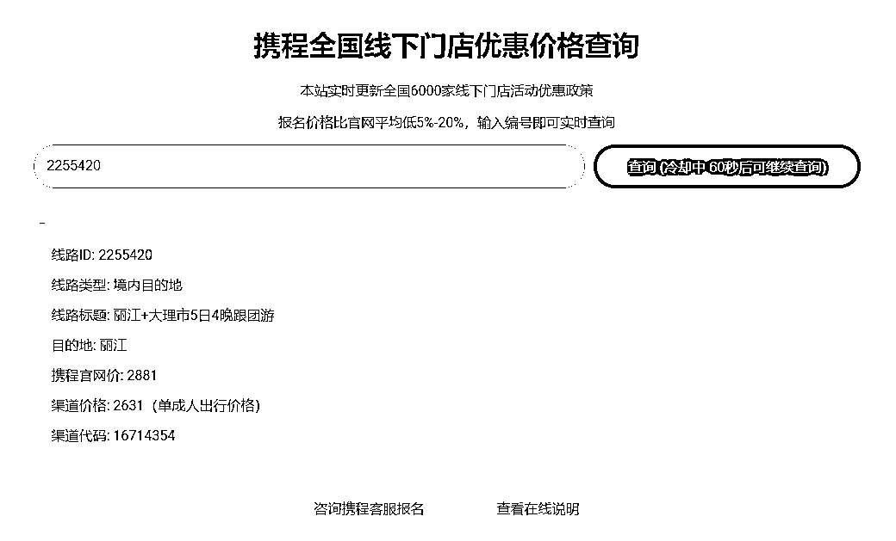
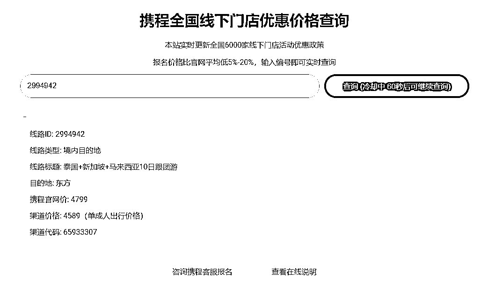

# 查询携程门店内部价格的平台，变现超过 10 万+的小信息差

> 原文：[`www.yuque.com/for_lazy/xkrm14/hepslb11xawua148`](https://www.yuque.com/for_lazy/xkrm14/hepslb11xawua148)

作者： 月半一子一

日期：2024-03-13

点赞数：**164**

* * *

正文：

这个平台可以查询到携程门店的内部价格，出行后福利和行程和正价买的一模一样，之前问过作者平台里主要是携程的门店系统差价和一些线下渠道的定向优惠，目前我利用这个小信息差变现超过 10 万+，自用了好久，也推荐给身边好多朋友用过，在生财第一次发风向标，要是对大家有用的话我就写篇复盘把完整变现路径回溯一遍，算是小小的回报生财:)主要我觉得一模一样的东西，能省 200 就省 200，这钱留着多买点纪念品多香......
平台地址忘了发：www.zzsn.cn

* * *

评论区：

Denggh : 很棒，期待

KK 妍 : 请问这是什么平台

Nic : 点赞，蹲一个

月半一子一 : 作者自己开发的平台，里面对接的是携程的产品

公子李 : 等期待

🍑短短~ : 期待分享。[呲牙]

头上两道疤 : 期待分享！~

Feng : 期待分享,蹲一个

* * *

公众号懒人搜索，懒人专属群分享