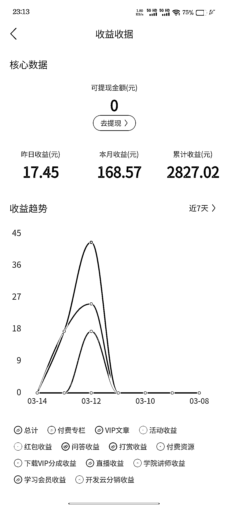
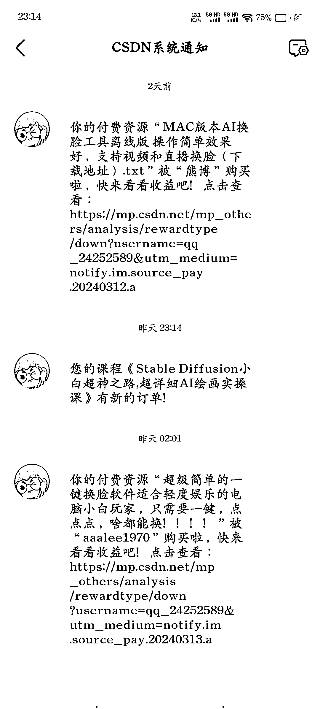

# CSDN：IT 技术社区，高权重平台，躺赚月入一万的秘密

> 原文：[`www.yuque.com/for_lazy/xkrm14/uvkb1yxeg2rse9nc`](https://www.yuque.com/for_lazy/xkrm14/uvkb1yxeg2rse9nc)

作者： 晨旭

日期：2024-03-14

点赞数：**76**

* * *

正文：

CSDN 是一个中文 IT 技术社区，也是 IT 类资源变现的场地，而且百度 seo 权重也是非常高的，只要搜索基本前几位都是 csdn 的。
可以传付费资源、付费课程、积分资源等，但是也有一定的门槛，就是要持续输出一段时间文章或者上传一些资源，获取原力值，到了一定等级之后就可以发布付费资源了，基本两百个资源可以一个月躺赚几百块，如果可以坚持上传两三千个资源，基本什么事都不用管就可以月入八千到一万，是真的什么都不用管，别人付款后 csdn 直接发送资源的。

* * *

评论区：

蛤蟆先生 : 圈友你好，请教下付费课程是找的盗版的吗，有版权问题吗

才 : 看了下规则，一天最多 15 分，上传 2 篇就能得到，大于 1000 分 可以上传付费资源，也就是要更新 66 天才能上传付费资源

晨旭 : 上传的资源暂时没有发现有版权问题，但是课程最好是自己录一遍

晨旭 : 是的，有门槛是好事，能坚持下来的才能挣到钱，而且资源和课程上传之后一点都不用管，几乎零售后，后期是躺赚，而且 csdn 的百度权重高，不用我们做 seo

才 : 今天开始更新了，有收益了来给你报喜

才 : 什么样的课程受欢迎点，课程翻录的话，还可以在其他的平台再次售卖，这个课程可以多平台操作

* * *

公众号懒人搜索，懒人专属群分享