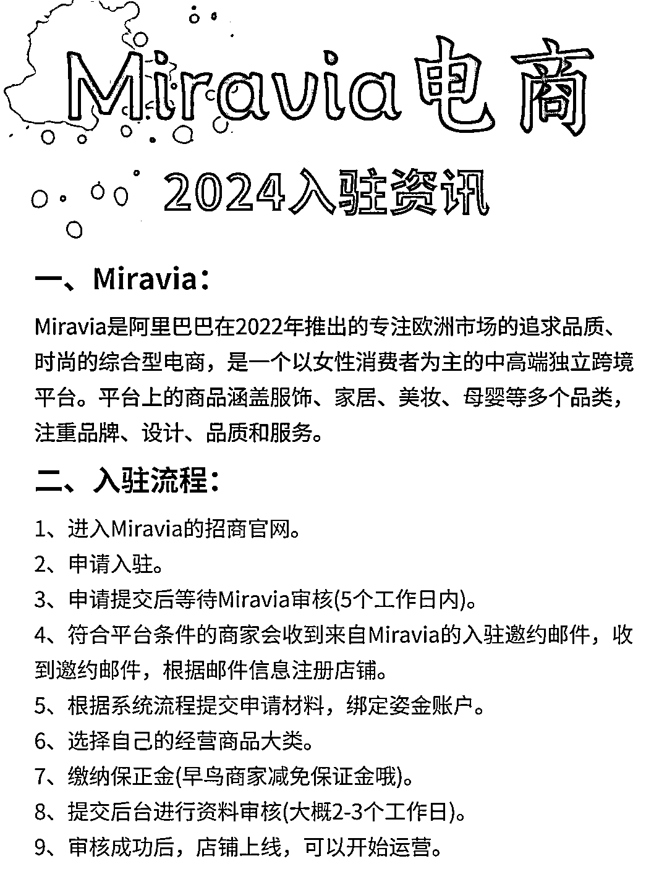
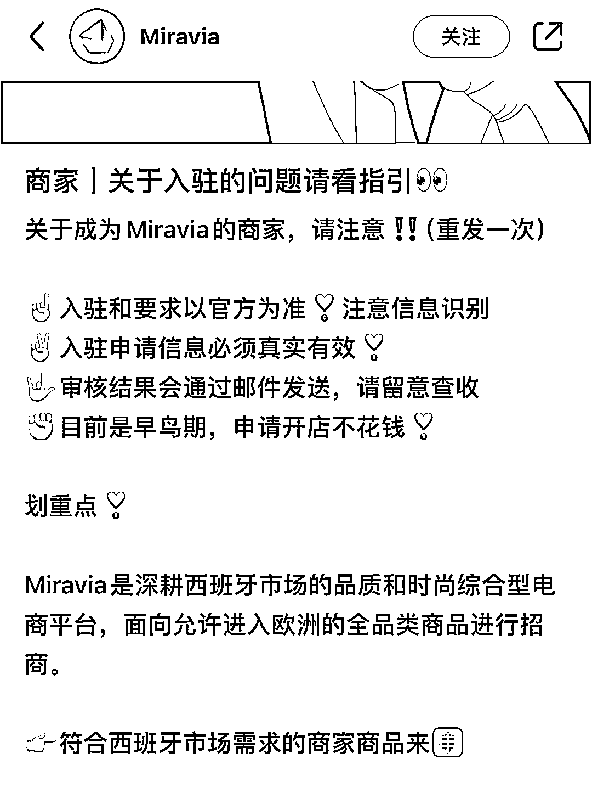
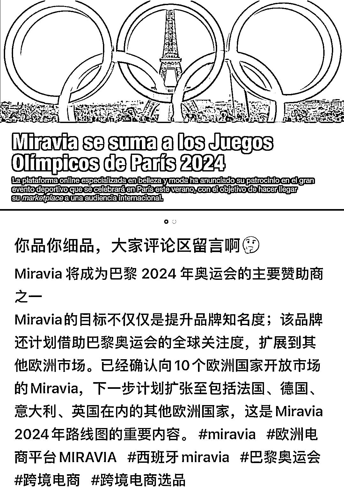

# 西班牙本土电商平台 Miravia，进军欧洲市场，高端化品牌对标亚马逊

> 原文：[`www.yuque.com/for_lazy/xkrm14/fmn18d31u9fry1hr`](https://www.yuque.com/for_lazy/xkrm14/fmn18d31u9fry1hr)

作者： 郭小帅

日期：2024-03-15

点赞数：**67**

* * *

正文：

跟大家说一个西班牙本土电商平台，Miravia. 这两年突然起来的，广告打得很大，还赞助了今年的巴黎奥运会，这是要进军整个欧洲的节奏
个人感觉是比较高端化，很多本土品牌，正牌，对标亚马逊，做跨境的小伙伴可以多看看 图二是 Miravia 的小红书官方号

* * *

评论区：

郭小帅 : 谢谢老大😄

* * *

公众号懒人搜索，懒人专属群分享