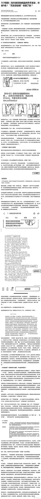

# 315 调查揭示：抖音购物商品拼多多发货，价差 5 倍！“无货源店铺“收割了谁？

> 原文：[`www.yuque.com/for_lazy/xkrm14/zz2la2bld0quudb3`](https://www.yuque.com/for_lazy/xkrm14/zz2la2bld0quudb3)

作者： Fwrd

日期：2024-03-15

点赞数：**70**

* * *

正文：

315 调查|在抖音买的商品拼多多发货，价差 5 倍!“无货源店铺”收割了谁?包含“无货源”相关的词条超过 6500 个。其中，针对“无货源店铺”赚差价的投诉存在于多个电商平台。不少消费者反映，在电商平台购物，却收到来自其他平台的发货短信，且商品价差较大。风头正紧，大家小心。

* * *

评论区：

* * *

公众号懒人搜索，懒人专属群分享