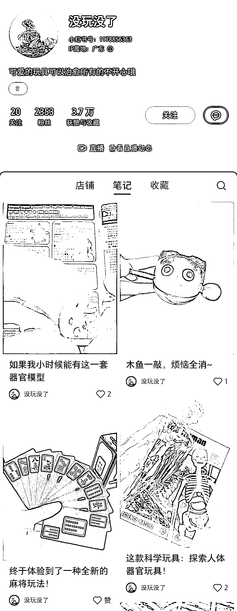
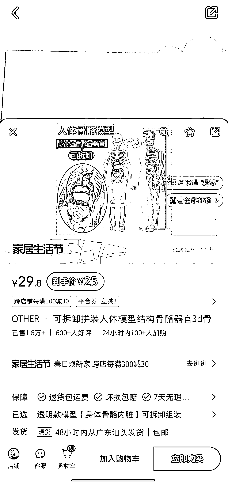
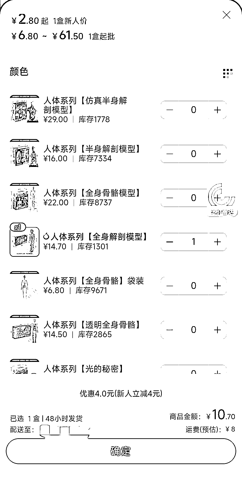

# 小红书上卖儿童玩具的低粉爆款——人体器官模型

> 原文：[`www.yuque.com/for_lazy/xkrm14/hc5ogycutowpgfri`](https://www.yuque.com/for_lazy/xkrm14/hc5ogycutowpgfri)

作者： 依依宝贝的设计师粑粑

日期：2024-03-18

点赞数：**55**

* * *

正文：

小红书上发现一个卖儿童玩具的低粉爆款——人体器官模型，寓教于乐，视频制作也很简单，阿里巴巴进货，利润在 50%左右，1.6 万销量也赚了有 16 万+了，可复制。

* * *

评论区：

* * *

公众号懒人搜索，懒人专属群分享