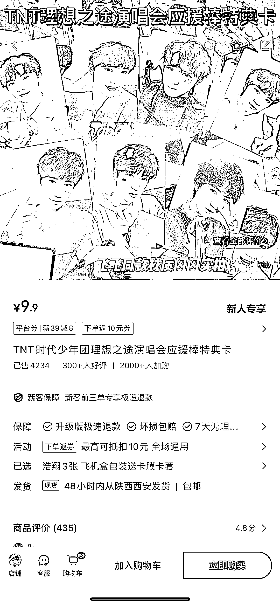
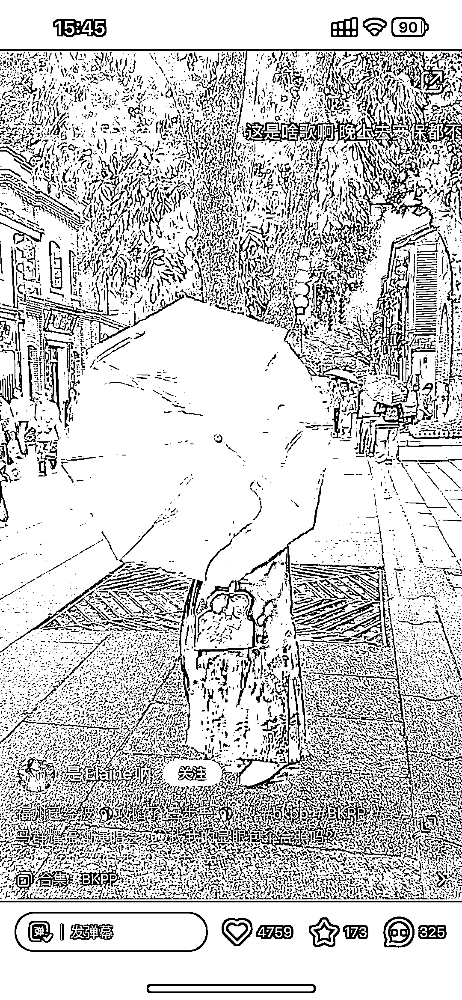
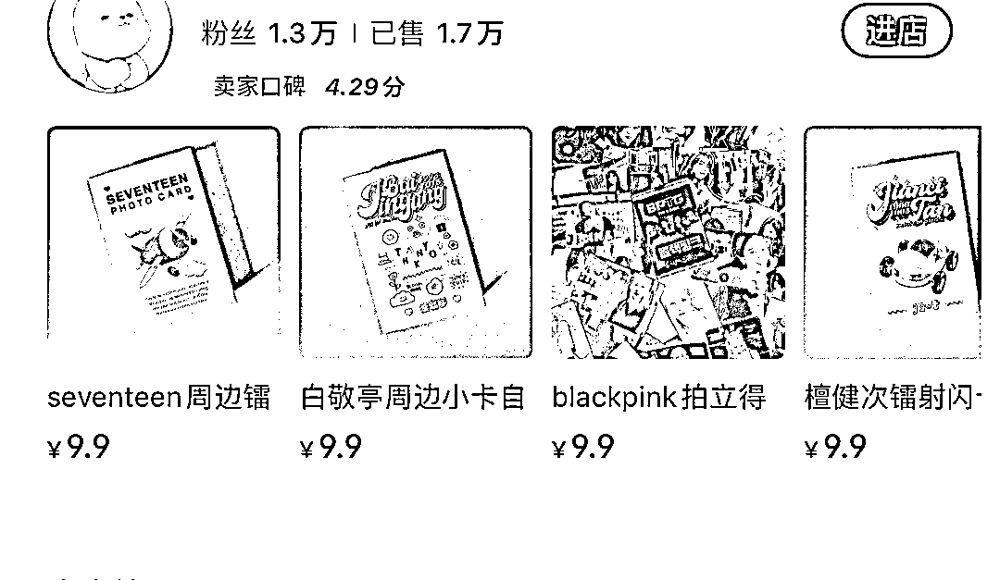
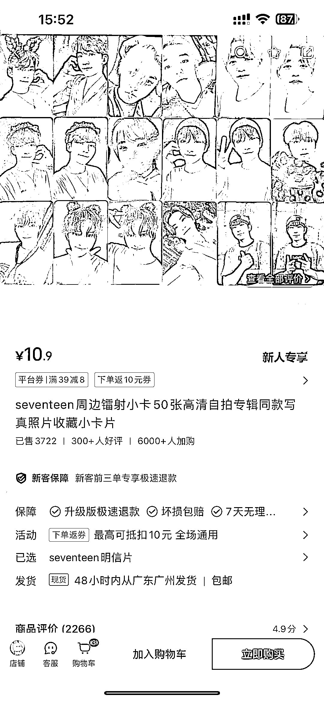
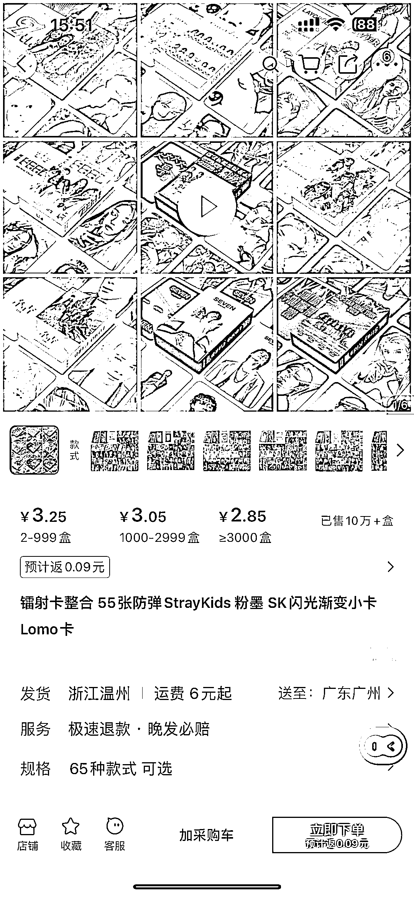

# 小红书卖应援产品 粉丝经济

> 原文：[`www.yuque.com/for_lazy/xkrm14/bzd94vd55k225qxt`](https://www.yuque.com/for_lazy/xkrm14/bzd94vd55k225qxt)

作者： 广州大学 啊泽

日期：2024-03-18

点赞数：**36**

* * *

正文：

小红书卖应援产品 粉丝经济 从一把新奇特的雨伞我去延伸 到发现很多小卡店铺 小卡价格在 9.9 以上 阿里巴巴拿货在 3 块 利润来说也达 50% 从人货场的角度来说
大部份都是女生去买 小红书刚好女生多 也许这个赛道是最有爆发潜力的

* * *

评论区：

广州大学 啊泽 : 谢谢[呲牙]

萝卜白菜叫我青菜 : 小卡质量不同的，去年研究过，一个是一比一复刻，一个是普通印刷，区别很大

* * *

公众号懒人搜索，懒人专属群分享