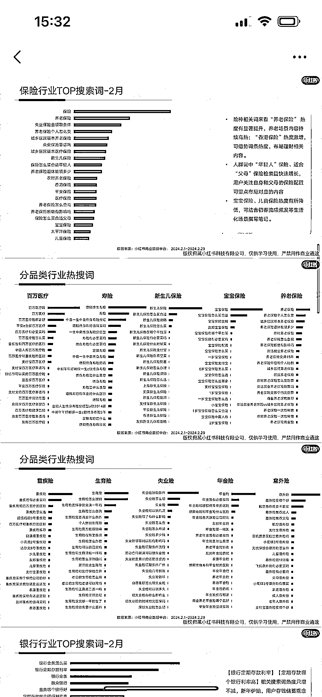
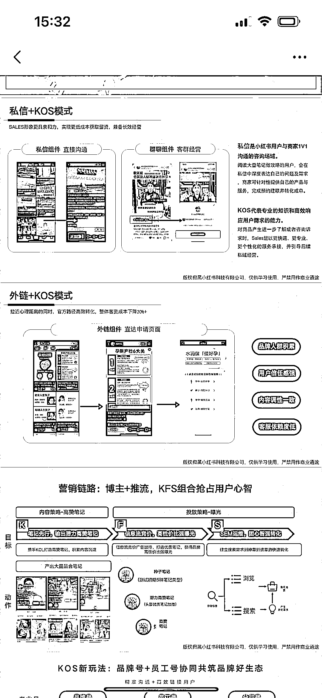
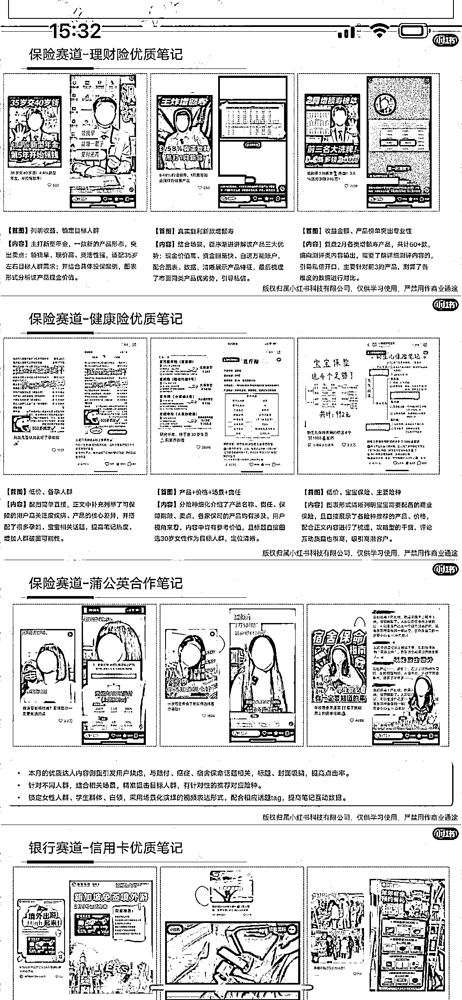
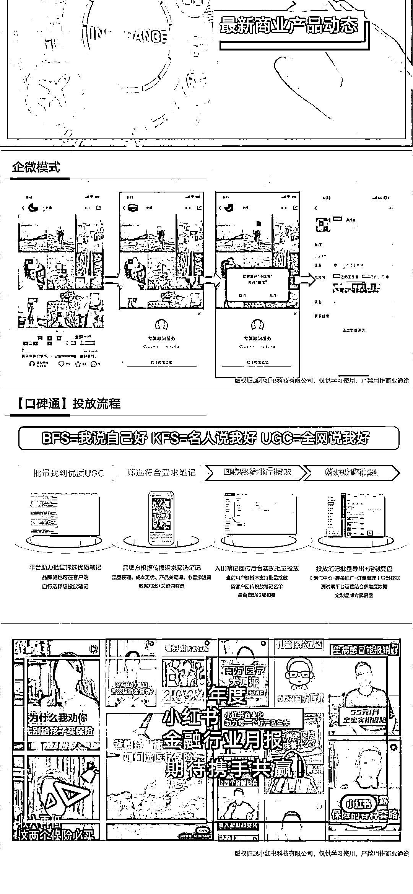

# 小红书与企微合作，为保险行业拓展新通道

> 原文：[`www.yuque.com/for_lazy/xkrm14/ygodqs5mwgg3xc62`](https://www.yuque.com/for_lazy/xkrm14/ygodqs5mwgg3xc62)

作者： 薯条 BO.A

日期：2024-03-21

点赞数：**40**

* * *

正文：

1.小红书与企微打通了通道 2.方便保险行业拓客 3.小红书保险热词：百万医疗、寿险、新生儿保险

* * *

评论区：

薯条 BO.A : [文件]20240321-小红书 2024 年金融行业月报-2 月.pdf 可复制链接到 WPS
Office 中打开文档[`kdocs.cn/l/cszZdh6MQNZh?f=301`](https://kdocs.cn/l/cszZdh6MQNZh?f=301) 

* * *

公众号懒人搜索，懒人专属群分享