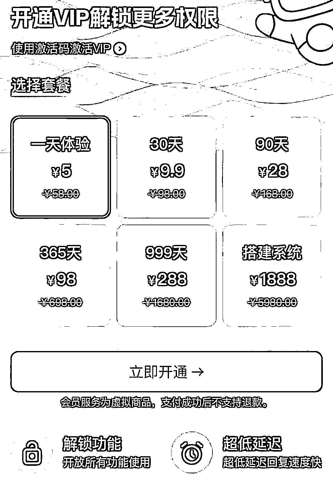
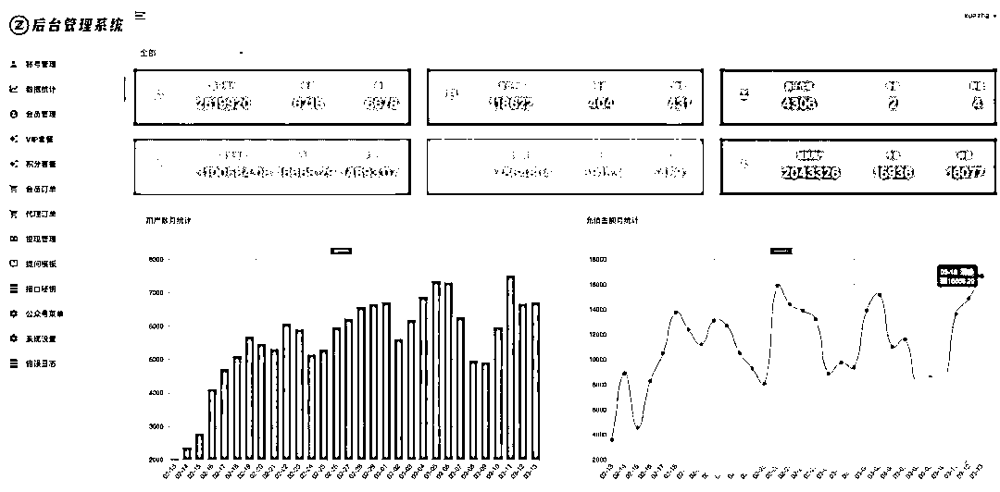

# 运营 GPT 镜像站，盈利模式多样，半年 GMV 达 300 万+

> 原文：[`www.yuque.com/for_lazy/xkrm14/xwm31okey7htcmqf`](https://www.yuque.com/for_lazy/xkrm14/xwm31okey7htcmqf)

作者： 真实姓名

日期：2024-03-19

点赞数：**79**

* * *

正文：

不知道是不是圈友做的项目，运营 GPT 镜像站 搭建平台，公众号用来留存粉丝，搞定流量问题，坐等收款，粉丝会有复购率 盈利模式：
1.卖会员：月卡 9.9，季卡 28，年卡 98 2.卖分站：定价 5980，成本 698 3.卖代理：代理拿充值佣金 6 成 4.公众号粉丝
半年时间平台 gmv300 万+， 需要做好敏感词拦截，接入相关部门备案

* * *

评论区：

亿安 : 公众号叫什么名字啊？

真实姓名 : 说是做的矩阵，搭建的公众号没去查过。

文轩 : 嘿嘿，被发现了[害羞]

真实姓名 : [强][强][强]太厉害了

3113 大吉大利 : 图二是哪里看到呀

* * *

公众号懒人搜索，懒人专属群分享