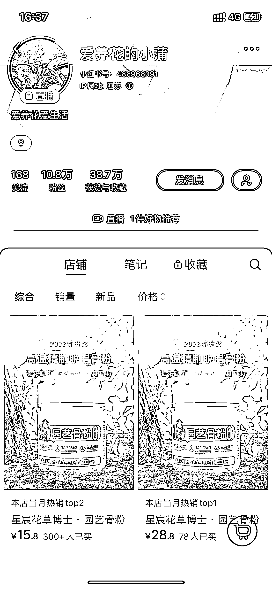
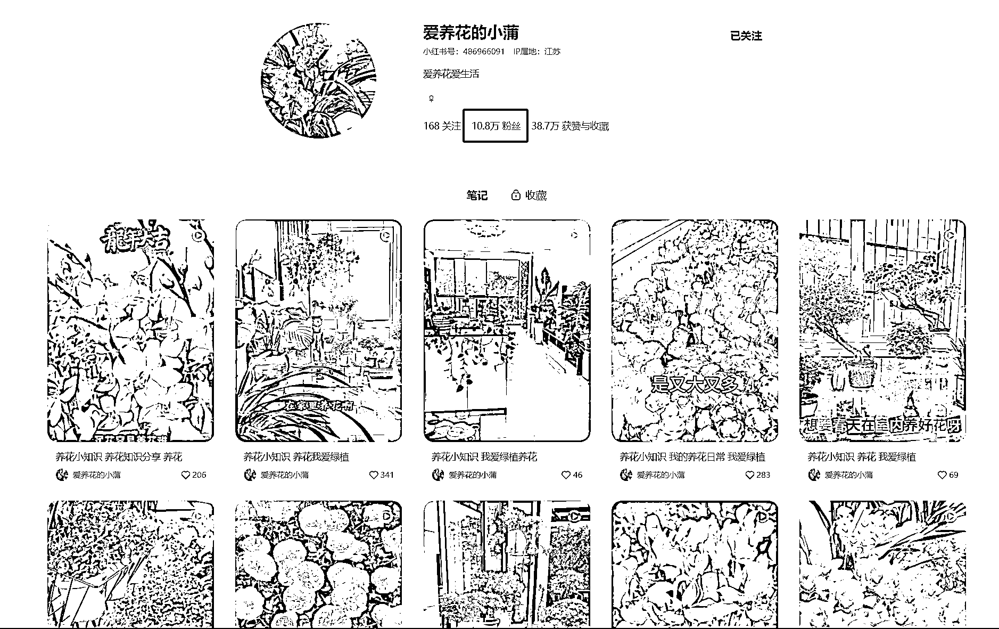
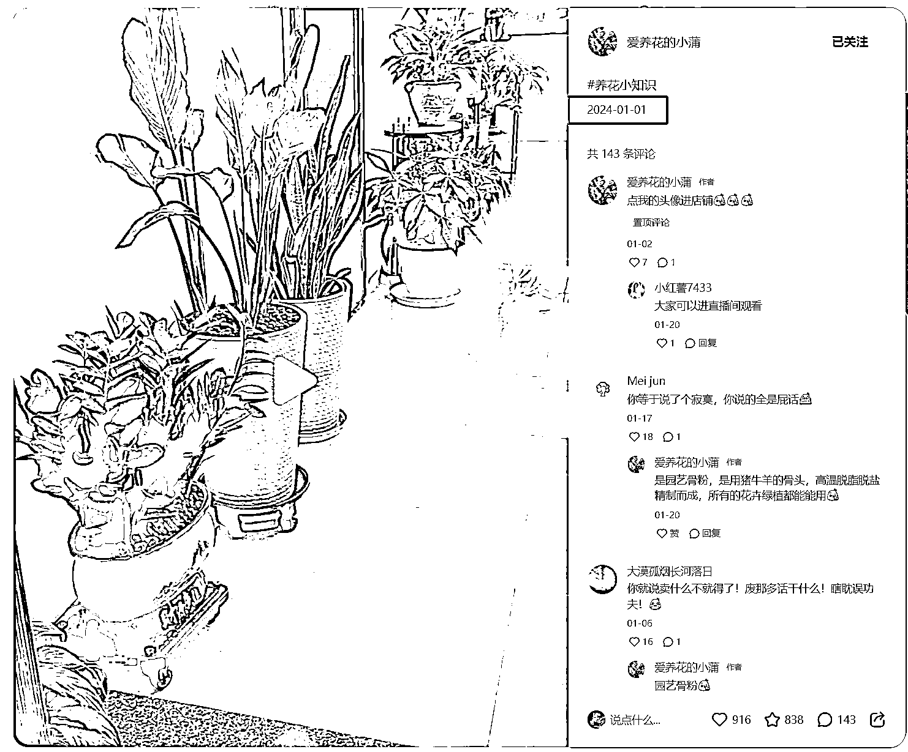
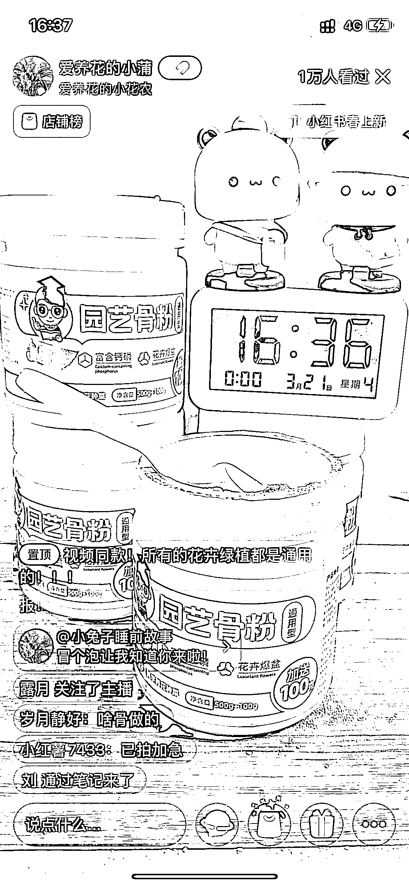

# 园艺赛道新账号，三个月吸粉 10.8w，简单复制的素材混剪带货方式，已卖出 400 多单

> 原文：[`www.yuque.com/for_lazy/xkrm14/cw50ctt1dd11zgrn`](https://www.yuque.com/for_lazy/xkrm14/cw50ctt1dd11zgrn)

作者： Bernie Fu

日期：2024-03-21

点赞数：**54**

* * *

正文：

园艺赛道，这个帐号 1/1 号发布第一条内容，不到三个月吸粉 10.8w，内容形式为素材混剪，文案高度雷同，制作非常简单好复制，直播带货无真人出镜，固定一个产品场景，目前已卖出 400 多单，非常好操作，相关赛道可以试试。

* * *

评论区：

艾小飞 : 他这是利用笔记爆款来做无人直播引导下单，现在我也在小红书上无人直播卖水果，效果还不错

* * *

公众号懒人搜索，懒人专属群分享