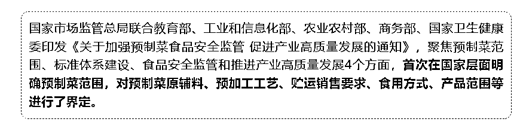
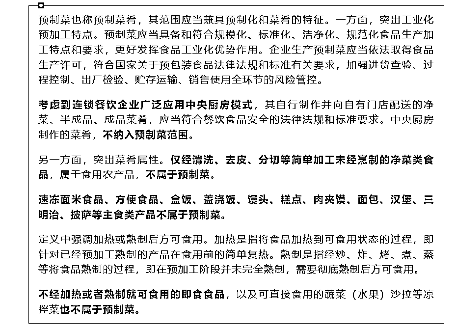
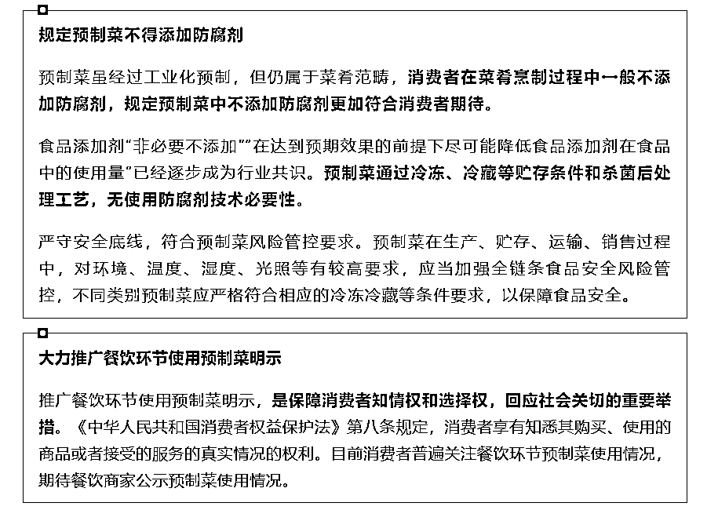

# 预制菜标准确定，生产过程禁用防腐剂，净菜不属于预制菜

> 原文：[`www.yuque.com/for_lazy/xkrm14/mt2e2v6le2945gzl`](https://www.yuque.com/for_lazy/xkrm14/mt2e2v6le2945gzl)

作者： mazhongyu

日期：2024-03-21

点赞数：**29**

* * *

正文：

预制菜标准确定。 随着生活水平不断发展，不可避免的会越来越多同预制菜打交道。 做成半成品了，在家只需要加热或者空气炸锅即可省时省力（比如叮咚买菜盒马）
目前公布了首个规范，后续可以持续关注， 不从事相关行业的为了自己的后续口舌之欲， 从事的当然也更好了
六部门发文！预制菜终于有了明确定义和范围，生产过程不允许添加防腐剂、净菜不属于预制菜 (qq.com)

* * *

评论区：

* * *

公众号懒人搜索，懒人专属群分享