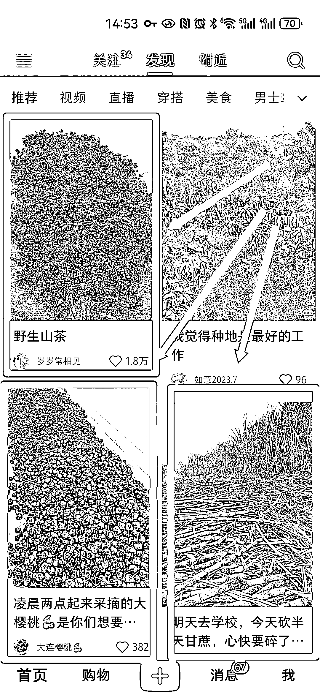
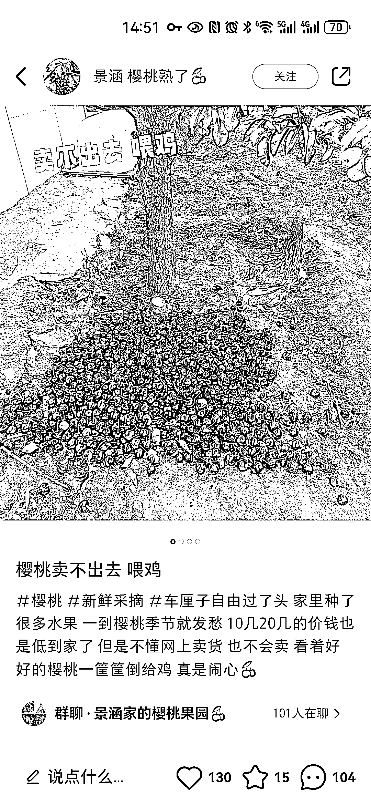
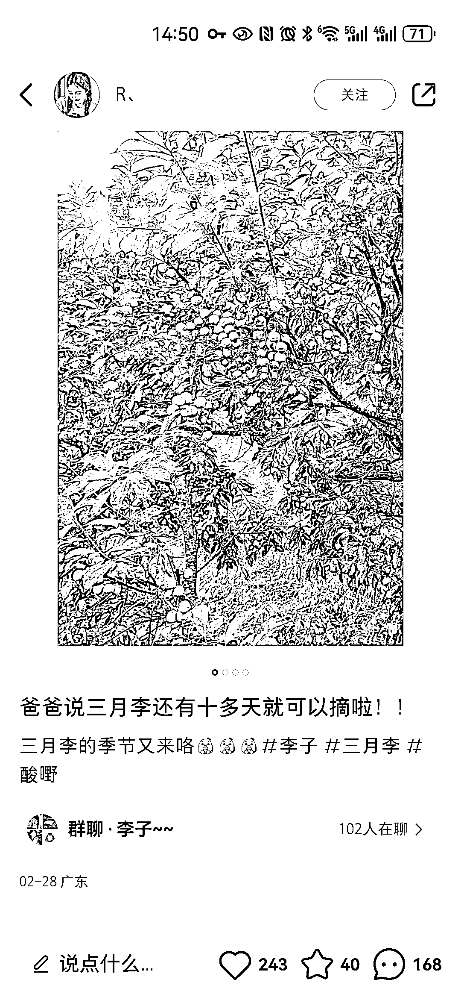
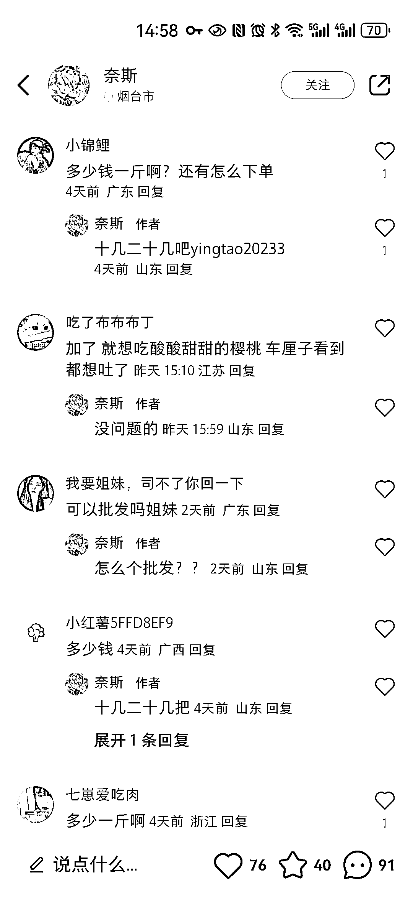
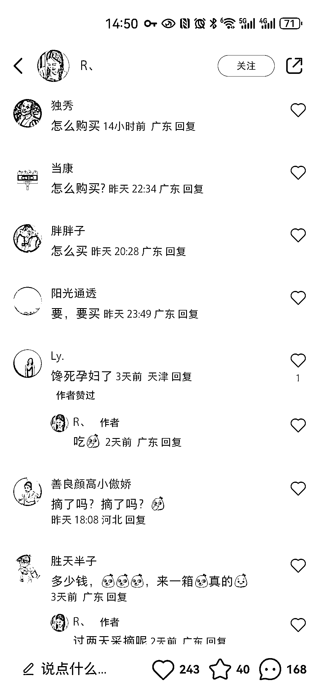
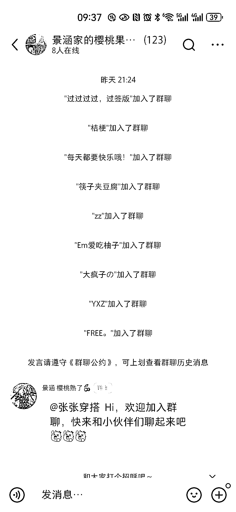
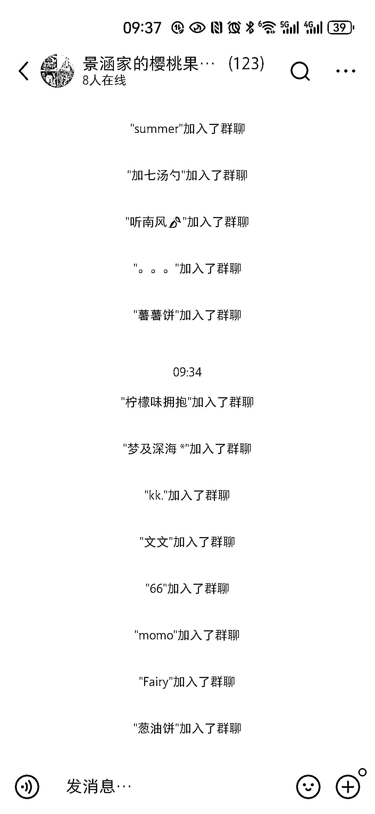
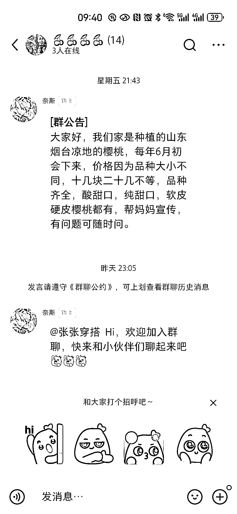

# 小红书种植户卖水果，探寻水果供应商

> 原文：[`www.yuque.com/for_lazy/xkrm14/wptymqrw1q7lyxyp`](https://www.yuque.com/for_lazy/xkrm14/wptymqrw1q7lyxyp)

作者： 希平

日期：2024-03-07

点赞数：**77**

* * *

正文：

小红书卖水果，或者在小红书找水果供应商
最近刷小红书，推荐了几十篇素人博主高赞的帖子（图 1），我很好奇，就点击进去看，发现不少是自家种植的，发帖说“今年大丰收，愁销路”，评论区好多人求买，但这些素人博主甚至都不回复。
流量：人设角度是种植户，发的内容基本都是拍自家果树挂满了果子的照片（图 2 图 3 图 4） 评论区出现不少求购买（图 5 图 6）
转化：从我昨晚 21 点进群，到今早 9 点，大概有 22 人进群（图 7 图 8），这些素人博主只是欢迎进群，最多发个群公告，告知果实成熟时间（图 9）
怎么做水果生意：可以看盗坤说做草莓年入百万的帖子
实际上，水果一直都适合做丝域，虽然存在淡季旺季，但水果上市时复购率超高，以及好几个水果错峰卖，还是相当哇塞的。[一个产品，年入百万](https://mp.weixin.qq.com/s/RYCY0OhGumN3BLENsbsk6g) 

* * *

评论区：

艾小飞 : 我就是在小红书上无人直播卖水果，趋势很大

希平 : 链接一下飞哥[呲牙][呲牙][呲牙]

林杰 : 我们做云南水果供应链 货源稳定 小红书需要代发的宝子们可以联系 做流量做的好的宝子可以一起合作共赢🎉

加麻 : 留个 v

林杰 : MJ0519573

艾小飞 : aifei9977

* * *

公众号懒人搜索，懒人专属群分享