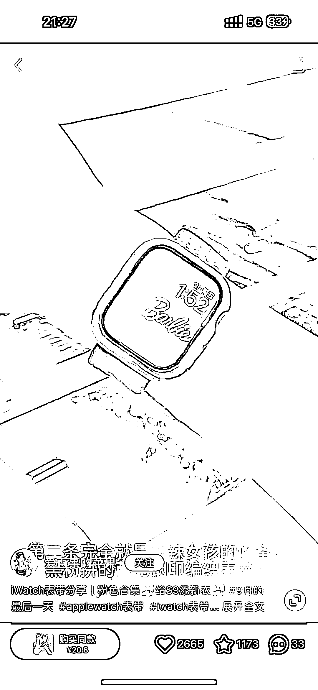
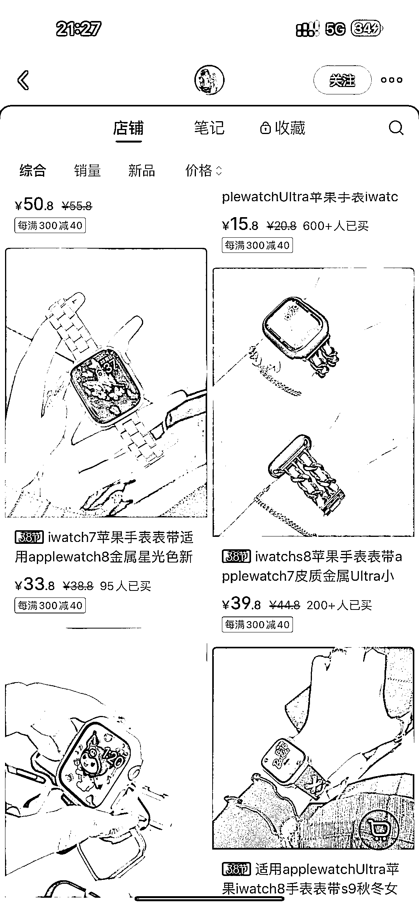
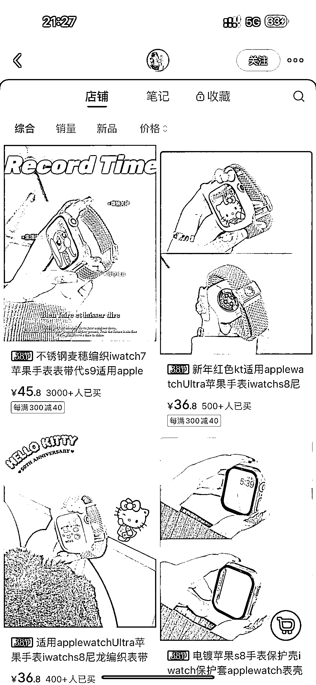
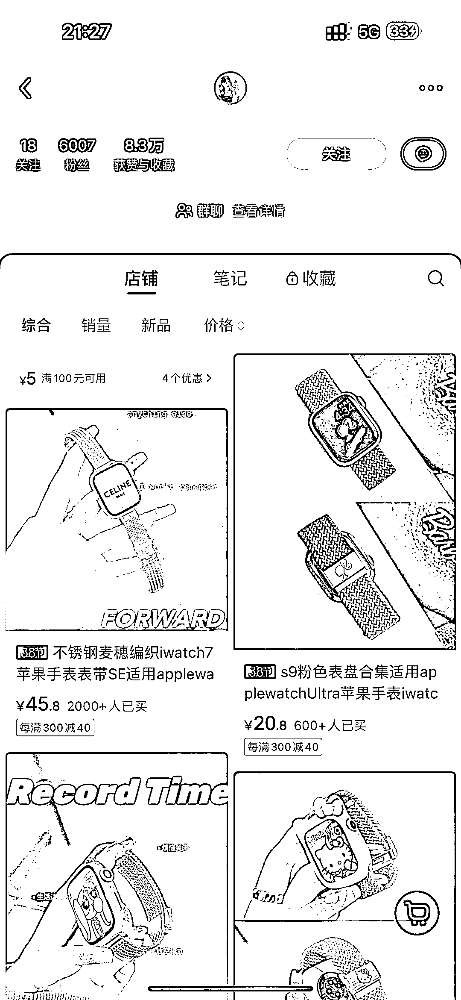
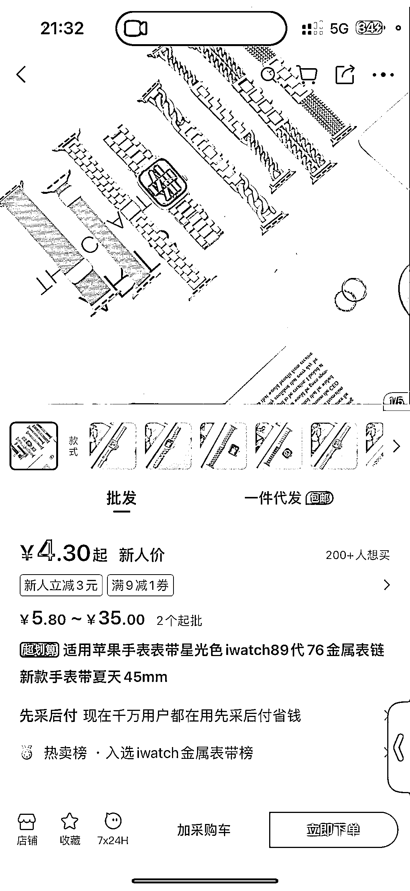

# iwatch 表带细分赛道，利润丰厚，小红书成购买热点

> 原文：[`www.yuque.com/for_lazy/xkrm14/yk0ovaf00h9tctkk`](https://www.yuque.com/for_lazy/xkrm14/yk0ovaf00h9tctkk)

作者： 请回答 .

日期：2024-03-04

点赞数：**56**

* * *

正文：

细分赛道：iwatch 表带 盈利：淘宝同款 20 元，1688 上 4.88 起批，小红书可以买到 40 元。
群体：虽然是小群体，但是分析这个博主她的粉丝量没上 w，但几款手表 3000+的卖，利润很高，而且买了 iwatch 的人 都很想多爱护、多花样的装饰。

* * *

评论区：

* * *

公众号懒人搜索，懒人专属群分享