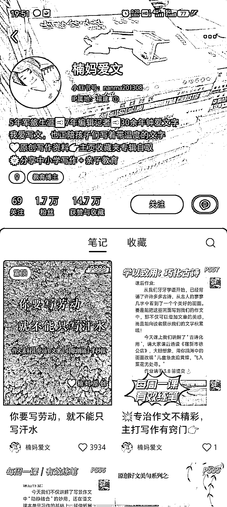

# 小红书利用 AI 技术进行儿童作业批改，开创新玩法并创造盈利空间

> 原文：[`www.yuque.com/for_lazy/xkrm14/lxidhf0rhebz2hcg`](https://www.yuque.com/for_lazy/xkrm14/lxidhf0rhebz2hcg)

作者： 毅智

日期：2024-03-04

点赞数：**51**

* * *

正文：

平台和项目： 小红书利用 AI 技术进行儿童作业批改 新的玩法：
在小红书上展示个人作业批改案例，每周发布 3-5 次内容，展示作文批改前后对比图，使用 AI 进行批改，并在图中标注修改建议。 盈利空间：
利用 AI 技术在小红书开设账号，提供作业批改服务，吸引家长付费购买，每单收费 40-60 元不等，也可开发其他针对宝妈的消费项目。

* * *

评论区：

* * *

公众号懒人搜索，懒人专属群分享