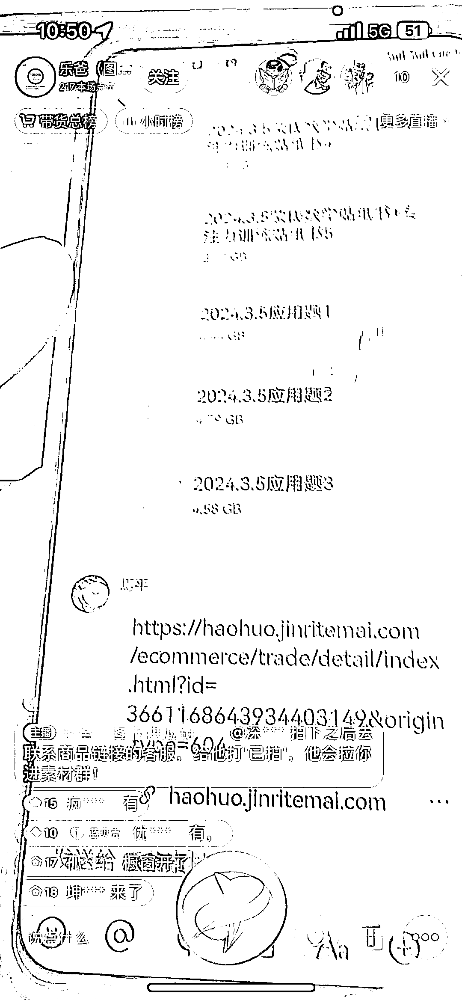

# 抖音橱窗带货模式：儿童绘本、图书、玩具，月成交额翻三倍

> 原文：[`www.yuque.com/for_lazy/xkrm14/ql2wh5zlr2a0u7gi`](https://www.yuque.com/for_lazy/xkrm14/ql2wh5zlr2a0u7gi)

作者： 天涯

日期：2024-03-06

点赞数：**52**

* * *

正文：

供应链推广抖音橱窗带货的模式，直播间人数很少，一直维持在十个左右，但是不断有人下单。做的是儿童绘本，图书，玩具，提供素材，教起号方法，我看直播间显示的数据，带货金额一个月 300 万左右，佣金 20-30%为主。去年数据是一年总成交额 1000 万左右，今年才到 2 月，月成交已经翻了 3 倍。

* * *

评论区：

陈先生 kelvin : 得投流，这种基本都是投流的

万简 : 下单可以造假吗

江大虾 : 乐爸是大 IP

小魏从 0 开始做副业 : 乐爸这个属于这个领域头部了吧

海苔🇨🇳 : 这个当时花了 399 进他的群，就拉了个企业微信群，说有问题里面问，然后就没然后了

天涯 : 按理说，他没有收费的需求啊，理论上越多人挂他的橱窗，他量越大

海苔🇨🇳 : 项目的尽头是知识付费，这个赚钱比卖书 简单多了，你刷刷看 就会刷到，换了好几个号不停直播 卖培训的

* * *

公众号懒人搜索，懒人专属群分享