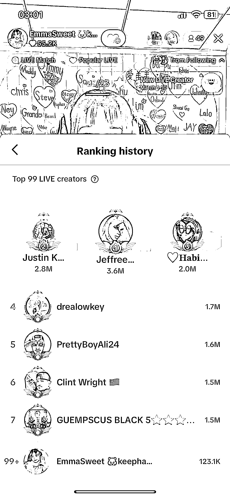
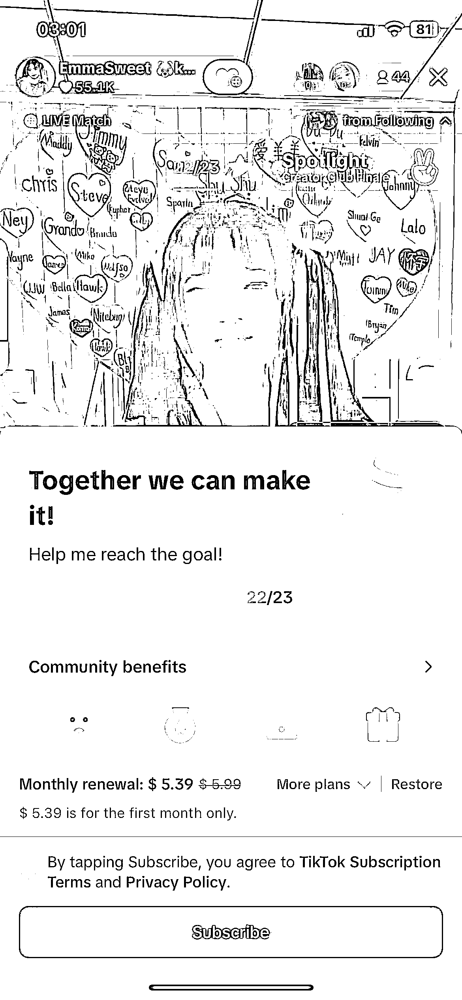

# 给大家看看 Tiktok 聊天直播一天的收益到底是多少？

> 原文：[`www.yuque.com/for_lazy/xkrm14/lgw9pt361wgitiqr`](https://www.yuque.com/for_lazy/xkrm14/lgw9pt361wgitiqr)

作者： 卫

日期：2024-03-04

点赞数：**94**

* * *

正文：

给大家看看 Tiktok 聊天直播一天的收益到底是多少？ 基本上都是几十个人在线 截止到我截图的时间
今天的收益是 410 美金，扣除官方的 50%，到账 1400 元人民币 订阅的收益是 22 个人*5.9 美金/人 上周收益是 1231 美金

* * *

评论区：

怪力小乔巴 : 是不是有语言的门槛？

李词宝 : 这收益怎么来的

张小多 : 请问这是直播了几个小时的收益？是否有语言要求啊？

卫 : 有

卫 : 一天

卫 : 打赏

崔立明 : 方便加个微信吗？想问一下专线的事情[握手][握手][握手]

* * *

公众号懒人搜索，懒人专属群分享