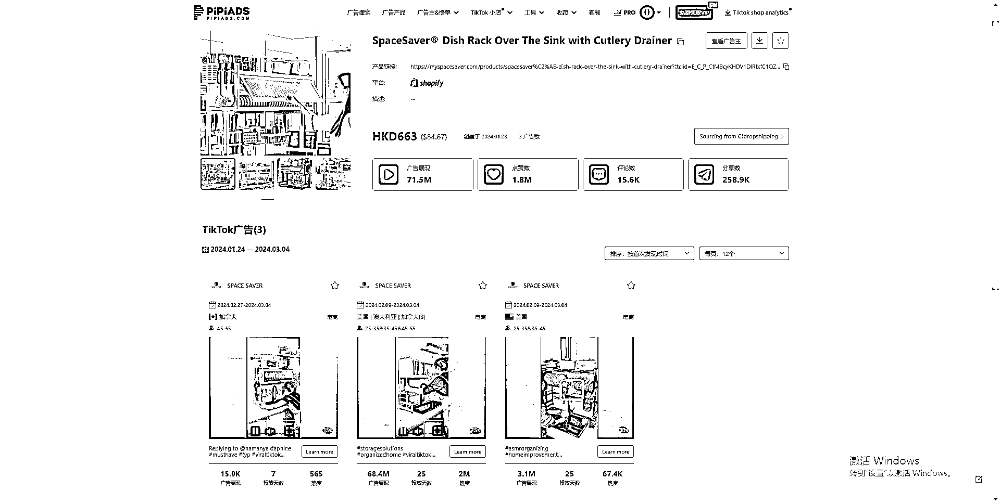
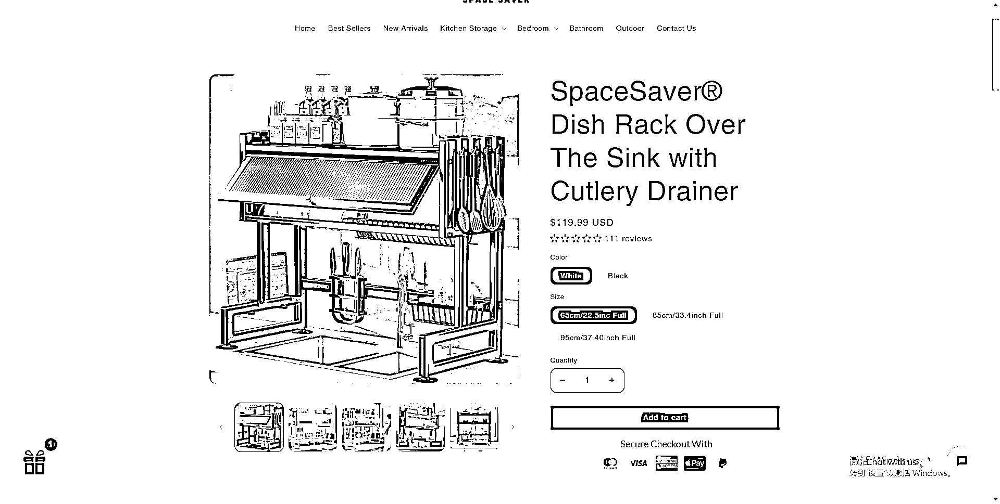
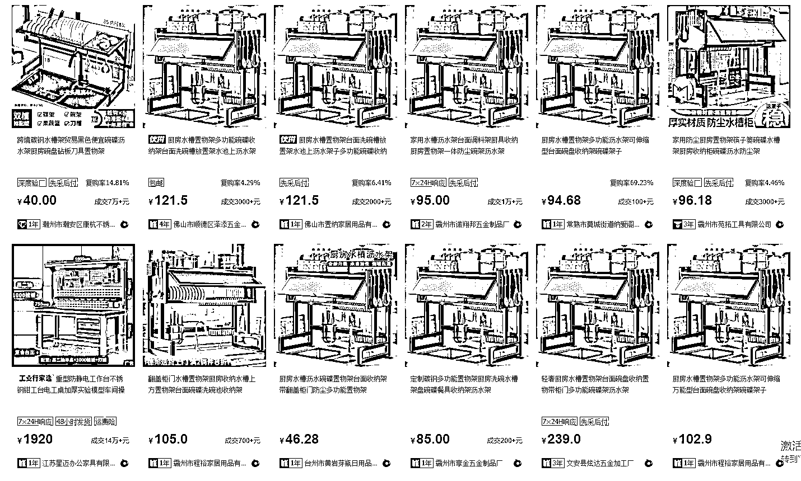

# Tiktok 上爆红的厨房餐具架，广告展现超过 7.15 亿次

> 原文：[`www.yuque.com/for_lazy/xkrm14/xznwamcwcgysbrrb`](https://www.yuque.com/for_lazy/xkrm14/xznwamcwcgysbrrb)

作者： Max

日期：2024-03-04

点赞数：**49**

* * *

正文：

这个厨房餐具架最近在 Tiktok 上以付费广告的形式投爆了。
根据数据平台 pipiads 抓取到的数据，该品从 2.09 号开始投放，至今不到一个月时间，总共 7150 万的广告展现，单素材最高播放量 6840 万，主要投放国家为美国、加拿大和澳洲。
独立站售价 120 美刀，阿里巴巴同款在 100 人民币左右。
高价差也就意味着在推广上有更大的容错空间，这类好物产品对比其他品有个好处就是素材门槛不会很高，只需展示物品的实用性，无需真人出镜。

* * *

评论区：

快乐柠檬 : Tt 的数据主要是 pipiads 看吗？

Max : 付费广告部分一般是在 pipiads 上看

* * *

公众号懒人搜索，懒人专属群分享