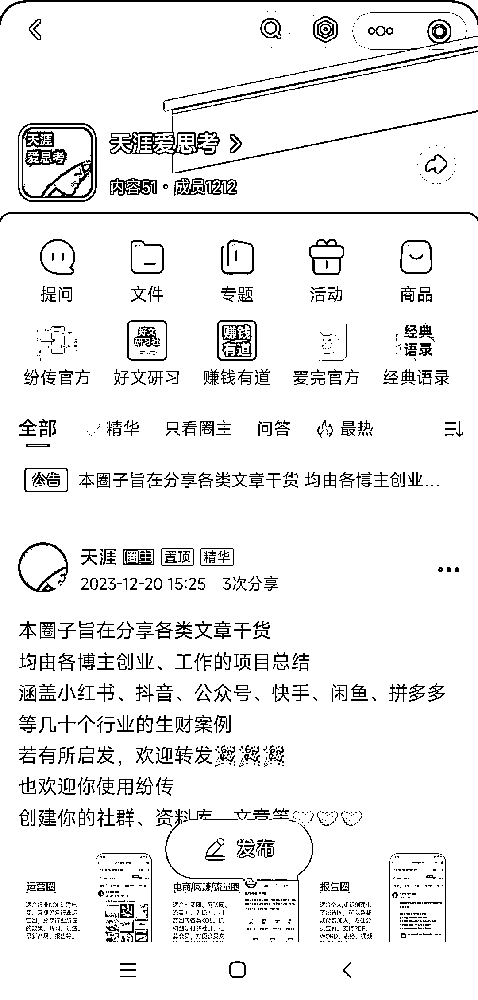
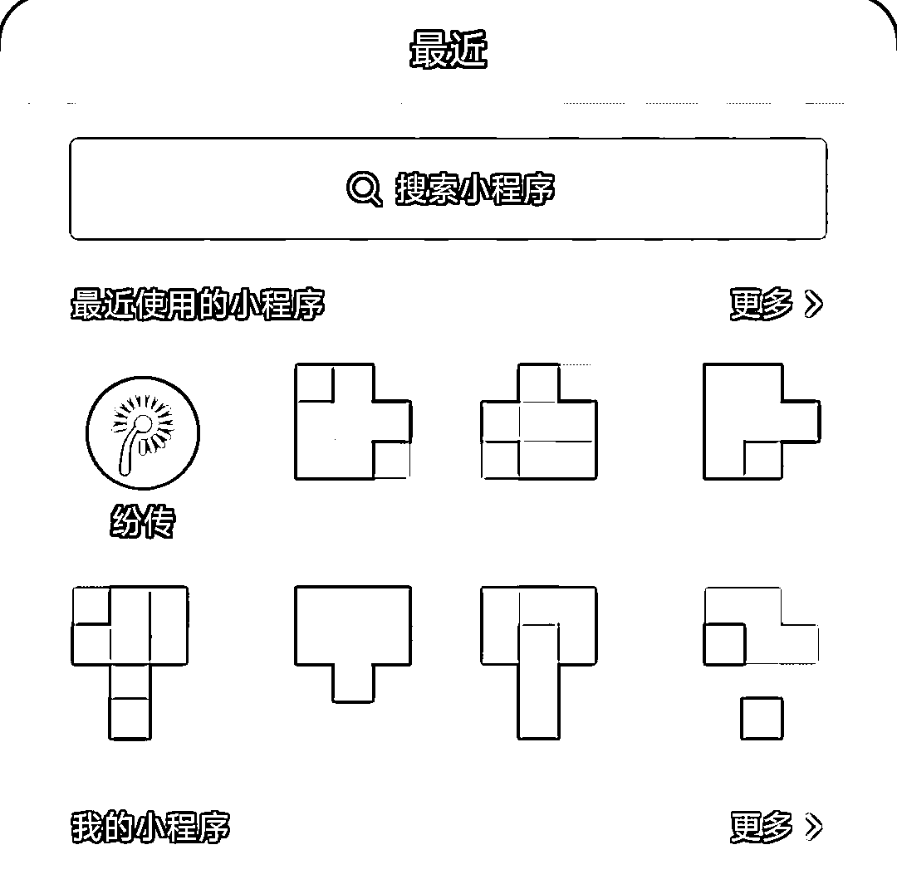

# 发现新小程序纷传，提供圈子和专栏功能，甚至可以付费阅读

> 原文：[`www.yuque.com/for_lazy/xkrm14/kgeqwu5ogd7cbug4`](https://www.yuque.com/for_lazy/xkrm14/kgeqwu5ogd7cbug4)

作者： 幻景

日期：2024-03-05

点赞数：**76**

* * *

正文：

这几天发现一个叫 纷传 的小程序，可以在里面建圈子和专栏，单篇文章也可以设置付费阅读。随意点进了几个圈子看了下，感觉还是有些内容的

* * *

评论区：

moonlight : 以前用知识星球，小报童，但是星球免费的现在门槛上来了，我看到好几个电商用这个

South wall : 有待优化，文件老是打不开，小程序体验感不是很好

怪力小乔巴 : 看到了一个叫“生财有道”的圈子😂

公子李 : 国内电商有好的社群推荐吗？

moonlight : 你要学什么

* * *

公众号懒人搜索，懒人专属群分享