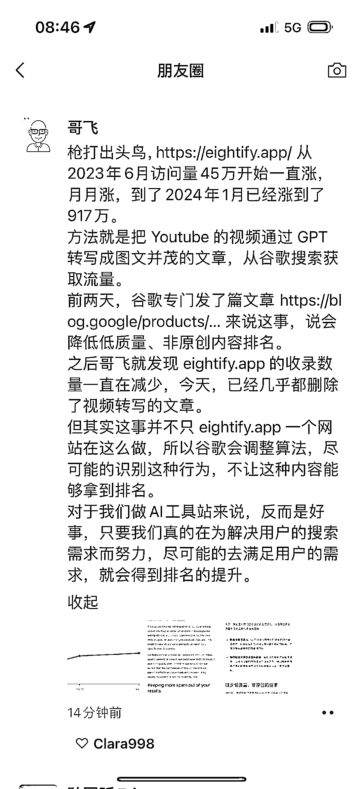

# Google 加强打击低质量内容，定义标准公布新更新

> 原文：[`www.yuque.com/for_lazy/xkrm14/wno84p1gfg9bfgki`](https://www.yuque.com/for_lazy/xkrm14/wno84p1gfg9bfgki)

作者： 胡二虎🐯

日期：2024-03-08

点赞数：**42**

* * *

正文：

Google 继续加强对低质量内容的打击，怎么定义低质量内容？ - 非原创 - 反对使用自动化大规模生成 - 托管第三方的垃圾内容（垃圾外链？） -
过期域名滥用 [Google Search: New updates to address spam and low...](https://blog.google/products/search/google-search-update-march-2024/) 

* * *

评论区：

林林 AIGC 写作 : 大佬也是我们的圈友哈，没想到你发了😂

* * *

公众号懒人搜索，懒人专属群分享