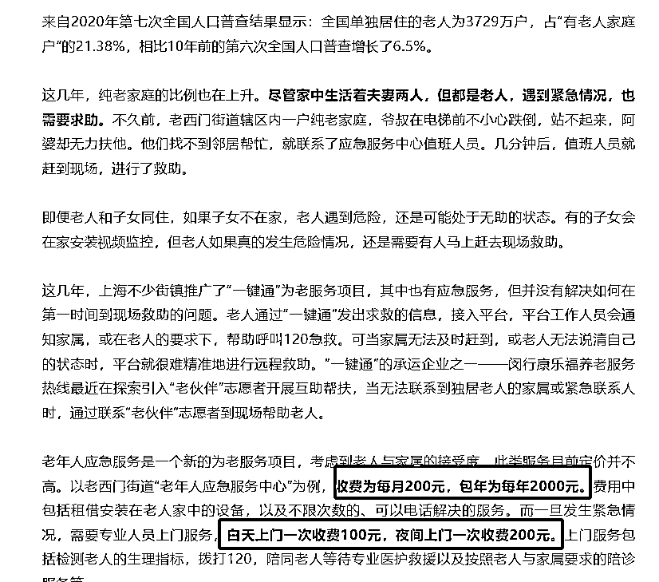

# 独居老人应急服务：摔倒后 15 分钟内赶到，为何只有 70 多人购买？

> 原文：[`www.yuque.com/for_lazy/xkrm14/ae790al9xwtn6gdi`](https://www.yuque.com/for_lazy/xkrm14/ae790al9xwtn6gdi)

作者： mazhongyu

日期：2024-03-07

点赞数：**74**

* * *

正文：

人口老龄化之后，独居老人情况越来越多 这些老人只能靠邻居或者子女远程视频。 但总归有力所不能及的时候
当老人在家跌倒、突感不适等，可以按响安装在家中的应急按钮或应急电话，有对应企业提供提供上门服务。 这个是 365*24 的 其他 老人的床上也会装有检测带
费用上（详见截图） 包年 2000/年，上门费最贵 200/次， 目前主要是无法规模化来降低成本，人员配置是固定的。 后续可以的方向是
在家加装探测装置检测老人是否有摔倒/提供心率带等类似可穿戴设备。 进而直接通知子女。 子女可以根据情况选择直接拨打 120 或者应急操作
[上海独居阿婆突然摔倒，他们 15 分钟内赶到！这么好的救命服务却只有 70 多人买，问题出在哪？](https://mp.weixin.qq.com/s/RIlqRKfZNFZJJJQuhwkkQQ) 

* * *

评论区：

加麻 : 香港二十年前就有这种项目了，比如香港的平安钟服务

* * *

公众号懒人搜索，懒人专属群分享