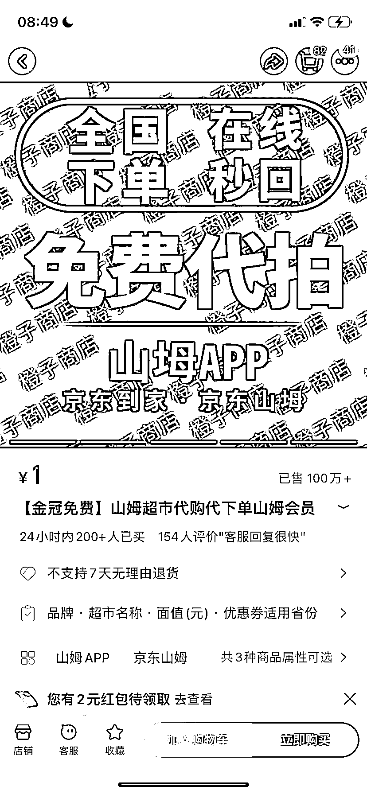
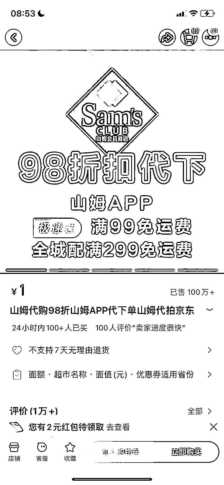
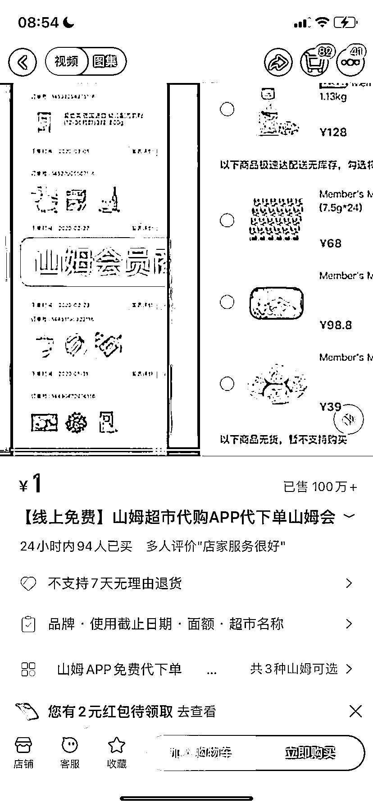
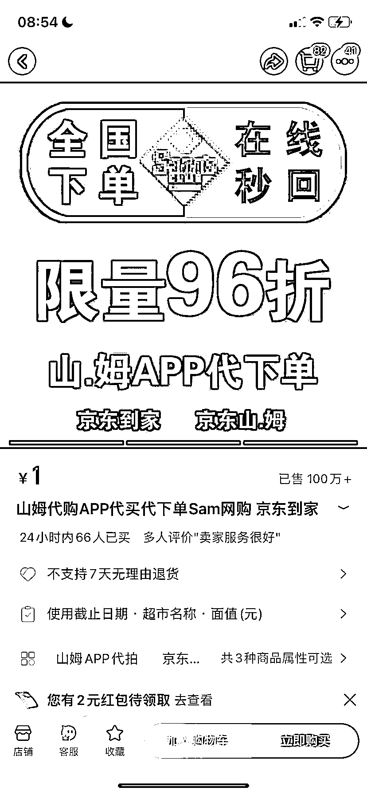
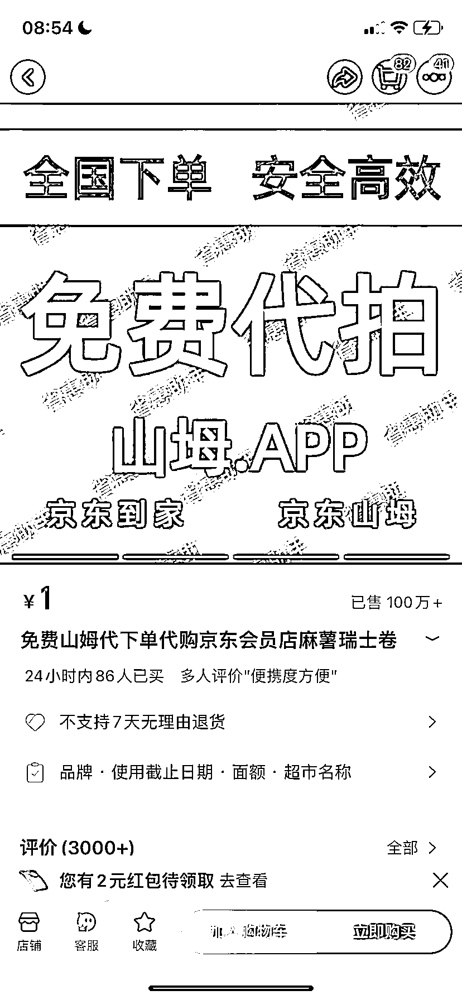
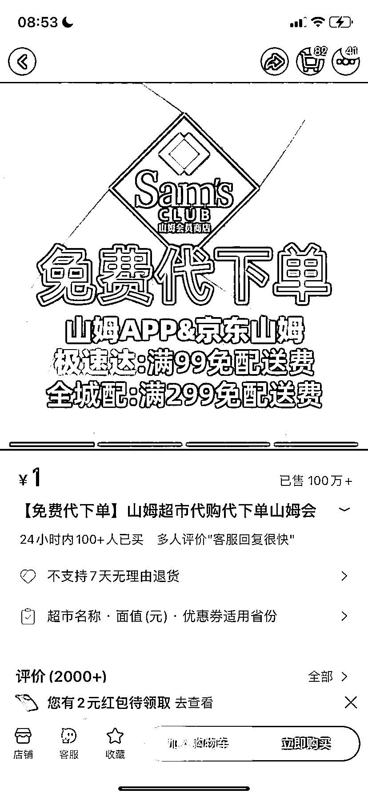

# 山姆代购：销量超 100 万＋，积分返利最高 500 元

> 原文：[`www.yuque.com/for_lazy/xkrm14/xuosa2tyo67wf5dr`](https://www.yuque.com/for_lazy/xkrm14/xuosa2tyo67wf5dr)

作者： 罗破帽

日期：2024-03-06

点赞数：**63**

* * *

正文：

山姆代购，多家销量超 100 万＋
a.客户在山姆 app 下单，截图保存发给在线客服报价后，客户在淘宝下单 1 元，商家用会员卡下单。一方面客户获得购买优惠价，另一方面商家赚取积分。
b.山姆的会员卡分两种，昔通会员卡 260 元一年，卓越会员 680 元一年，对代购们来说，后者跟前者最大的不同，是拥有 2%的积分返利权益。每消费 1 元积 2 分，每 1000 积分兑换 10 元积分券，每月最多可完换总额 500 元的积分券。
c.也就是说，每个月在山姆消费达到一定数额，最多可以赚回 500 块。如果矩阵去做，收益会更多。

* * *

评论区：

夏天 : 感觉这样赚得也不多呀，是不是叠加些信用卡的返现和积分权益

闫君 : 说实话这三种方式都不怎么赚钱。真正赚钱的是线下代购分拆开售卖，但这也是辛苦钱。

倪大胖 : 客户积累多了转团长是不是有戏

* * *

公众号懒人搜索，懒人专属群分享