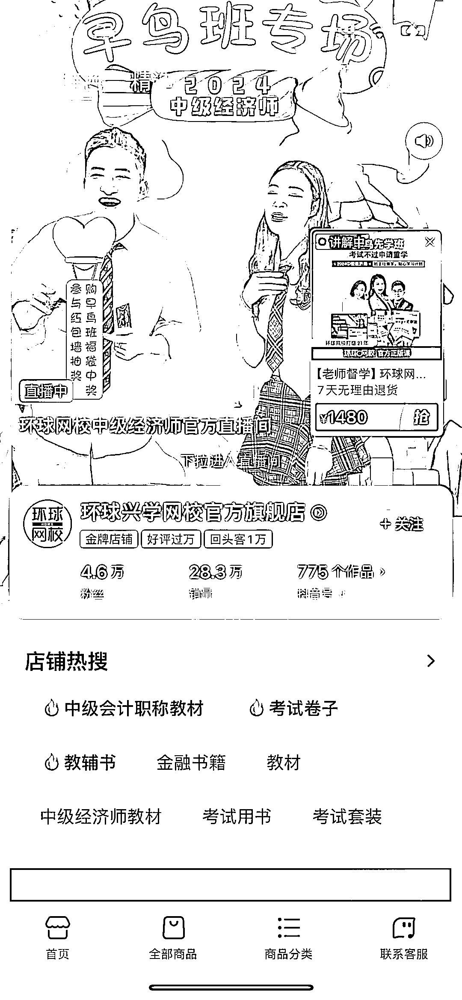
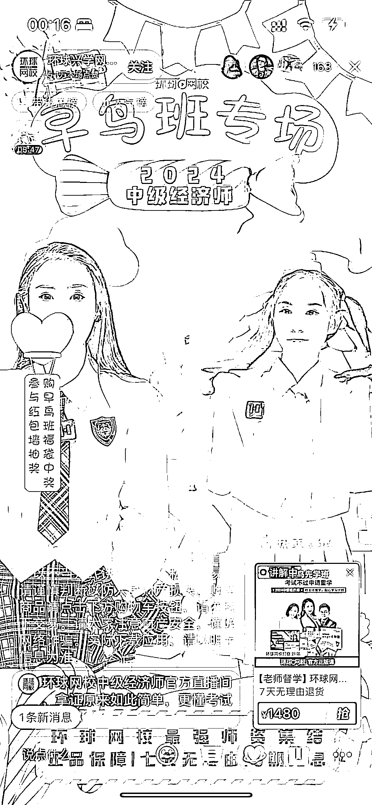
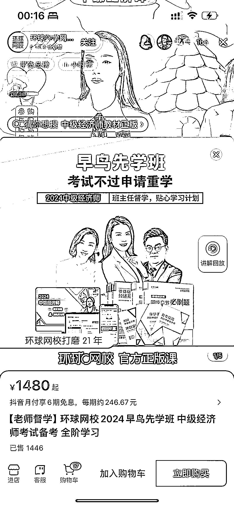
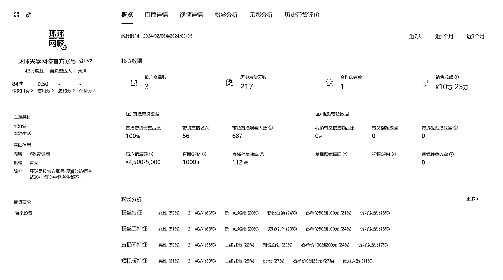
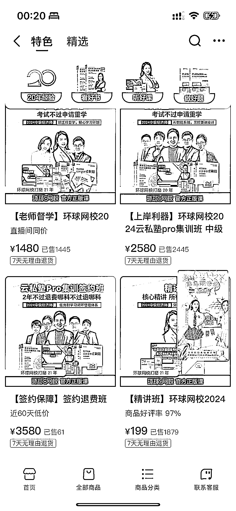

# 用纯电商打法卖网课

> 原文：[`www.yuque.com/for_lazy/xkrm14/ty9oi4sxvwo3qp5l`](https://www.yuque.com/for_lazy/xkrm14/ty9oi4sxvwo3qp5l)

作者： 北辰

日期：2024-03-08

点赞数：**57**

* * *

正文：

用纯电商打法卖网课。 直播卖课，青春美少女叫卖式，不聊课程细节。
主打经济师考试课程，近一个月销售额 10-25 万。橱窗累计销量 28 万，平均单价 1585¥，累计销售额数千万。

* * *

评论区：

申姐全域营销 : 不错，这个数据的后台是在哪个后台看到的撒

北辰 : 抖音官方的 巨量百应

* * *

公众号懒人搜索，懒人专属群分享