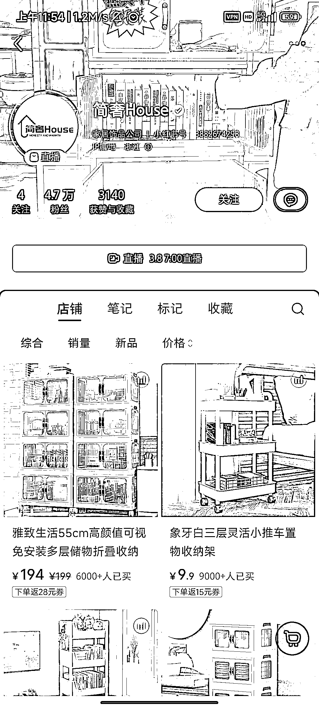
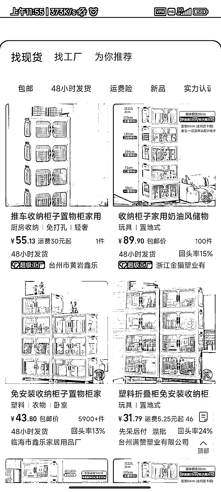

# 简奢家具通过无人直播实现利润 60w+

> 原文：[`www.yuque.com/for_lazy/xkrm14/fk8uq2iiggyguqfp`](https://www.yuque.com/for_lazy/xkrm14/fk8uq2iiggyguqfp)

作者： 磊爷

日期：2024-03-04

点赞数：**44**

* * *

正文：

简奢家具，靠（无人）直播，利润 60w+

* * *

评论区：

墨子 : 1688 上有不同规格的，50 多是柜子数量比较少的。实际小红书的价格和 1688 相差不了多少，而且也不是无人直播，是企业店铺

磊爷 : 不好意思，我表述不太清楚，这个店主卖的一款 194 的四层柜子，1688 售价 100 左右的很多。 店铺主要靠直播带货，可以叠加无人直播做[呲牙]

磊爷 : 两天后，销售额增加 100w

SL : 请问这个在 tiktok 上面做怎么样

磊爷 : 不知道哎，可以找一下有没有人做过，或者自己验证一下

* * *

公众号懒人搜索，懒人专属群分享