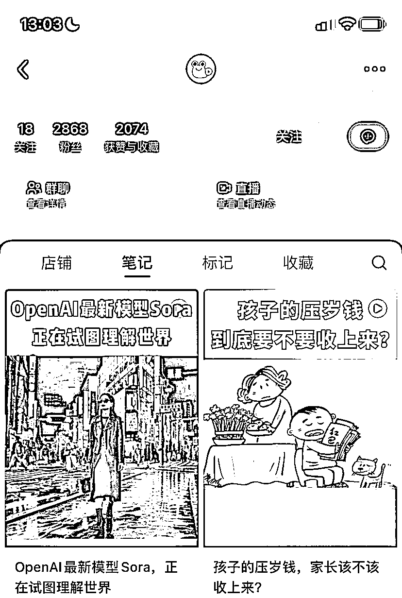
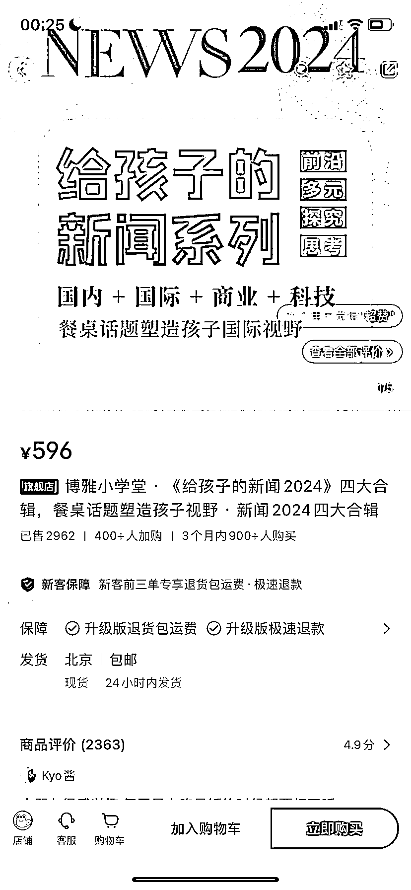

# 小红书博主成功卖出《给孩子的新闻 2024》专辑，销售额近 177 万元

> 原文：[`www.yuque.com/for_lazy/xkrm14/dtsgwukyhyhysr2p`](https://www.yuque.com/for_lazy/xkrm14/dtsgwukyhyhysr2p)

作者： 罗破帽

日期：2024-02-28

点赞数：**90**

* * *

正文：

a.2868 个粉丝的小红书博主，卖《给孩子的新闻 2024》新闻专辑。 a.2024 年专辑，客单价 596 元，已售出 2962，销售额近 177 万元
b.2023 年专辑，客单价 499 元，已售出 2912，销售额是 145 万
c.专辑包括国内新闻，国际新闻，商业新闻，科技新闻四大板块，都是纯音频课，目的是塑造孩子的国际视野。

* * *

评论区：

吴智新 : 这个有意思

发发 : 我刚看了一下他们的商品，好像要搭配 app 使用[流泪]

Mi : 关注引力盒子 每天都有给儿童的新闻

发发 : 我其实挺好奇如果自己来怎么卖会更合适

* * *

公众号懒人搜索，懒人专属群分享