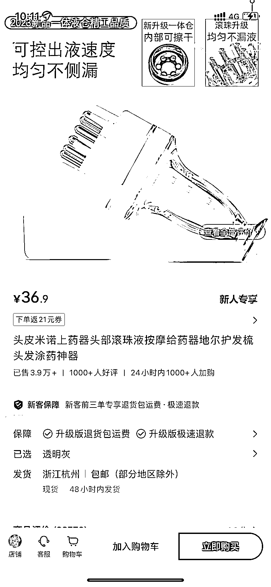
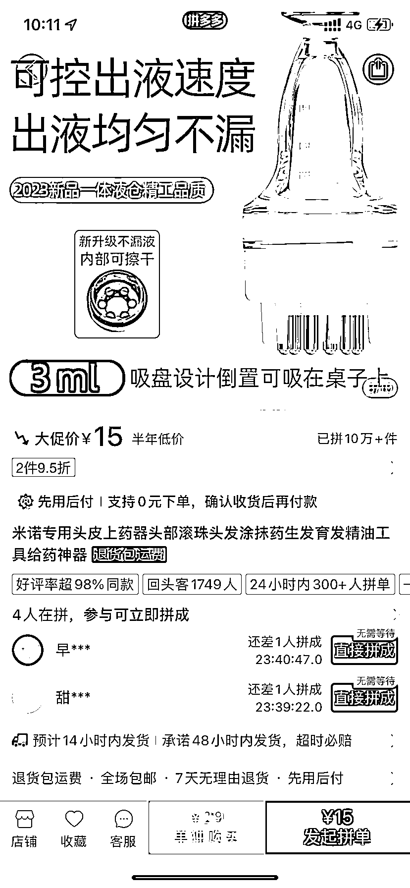

# 小红书店铺瞄准脱发人群，销售热卖药品，利润可达 85w+

> 原文：[`www.yuque.com/for_lazy/xkrm14/ba2c3dkqd4frdtl7`](https://www.yuque.com/for_lazy/xkrm14/ba2c3dkqd4frdtl7)

作者： 谜鹿

日期：2024-02-27

点赞数：**66**

* * *

正文：

小红书店铺，米诺地尔酊上药器，已售 3.9w+，瞄准脱发人群涂药的痛点； 小红书卖 36.9 pdd 同款 15，利润 21.9 元/件 ，约赚 85w+

* * *

评论区：

* * *

公众号懒人搜索，懒人专属群分享