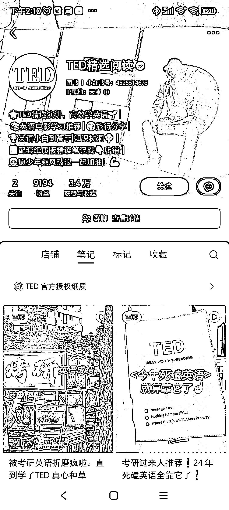
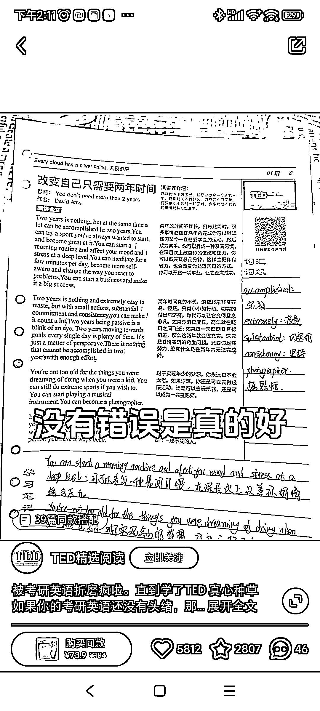
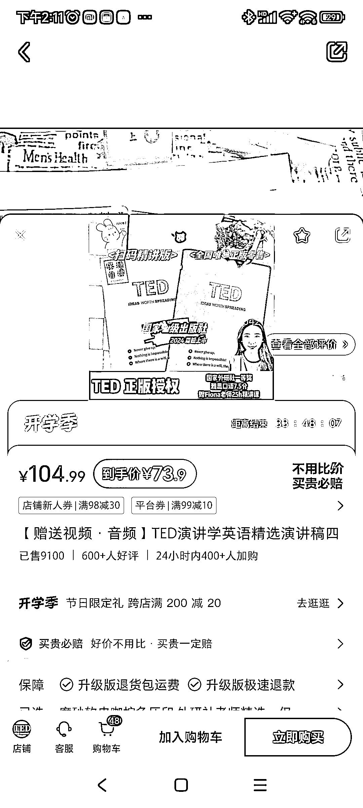

# 小红书电商平台满足英语学习爱好者需求，推荐 TED 教材

> 原文：[`www.yuque.com/for_lazy/xkrm14/fd7ol5d2oyxtzhh0`](https://www.yuque.com/for_lazy/xkrm14/fd7ol5d2oyxtzhh0)

作者： 画说

日期：2024-02-29

点赞数：**63**

* * *

正文：

赛道+垂类项目：小红书电商 目标人群：英语学习爱好者 需求：满足想学好英语，不知道看什么教材的人
平台：小红书，持续发这个教材的翻阅视频，配合剪映里的数字音频，一个内容用不同的配音反复拍。持续曝光。
内容方面主要是说 TED 的内容，以及加上张雪峰老师的照片暗示。
首先 TED 的内容不需要多说，没有教育成本，其次视频有介绍说，重点词句都整理好了，直接背就行，还能扫码看原视频。
盈利空间，目前看到已经卖了 9100+，打完折 74 元的价格，也不少，同时店铺中还有其他相关资料

* * *

评论区：

* * *

公众号懒人搜索，懒人专属群分享