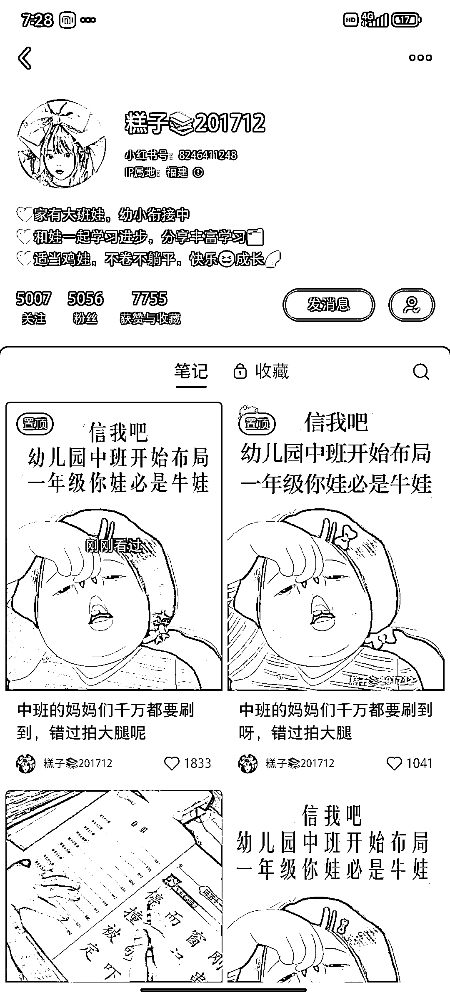
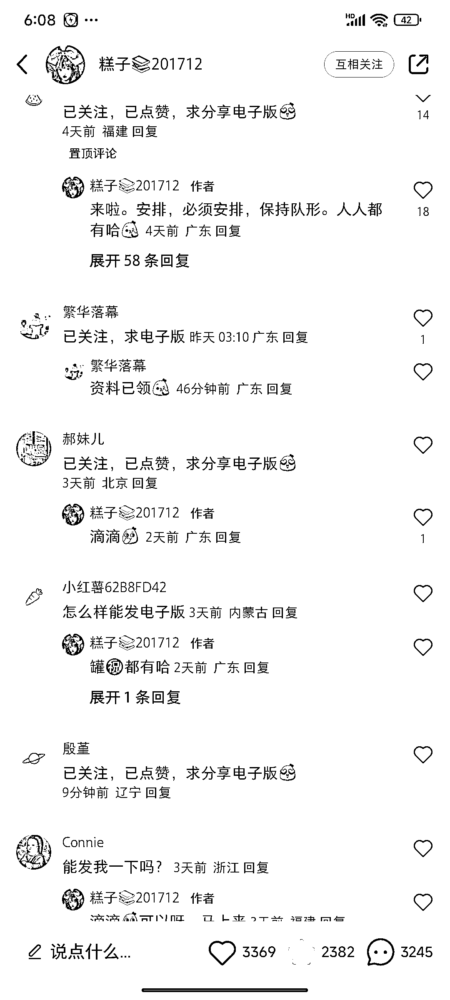

# 小红书账号引流成功，4 天粉丝增长超过 2 万人

> 原文：[`www.yuque.com/for_lazy/xkrm14/yb82kygbhe04l298`](https://www.yuque.com/for_lazy/xkrm14/yb82kygbhe04l298)

作者： 乐天

日期：2024-02-27

点赞数：**52**

* * *

正文：

刷小红书看到一个账号点赞很高，粉丝只有 5000 多。 目标人群：宝宝在上幼儿园望子成龙的宝妈 需求：害怕孩子被比下去，想要孩子上一年级比别的孩子强
平台和项目：在小红书发幼小衔接资料，引导宝妈关注账号，通过拉群发领取资料方法的视频，引流到微信。
盈利空间：微信群短短一天加了 200 多人，粉丝 4 天时间从 5000 增长到 2w 人

* * *

评论区：

大宁 : 那后续变现是卖资料还是卖东西？

乐天 : 目前没看到他的商业模式，群主提供的资料也都是免费的。后续估计会有收费的课程或者是资料吧

和光同尘 : 这种账号是天选之子，一般账号不会上来就爆的

* * *

公众号懒人搜索，懒人专属群分享