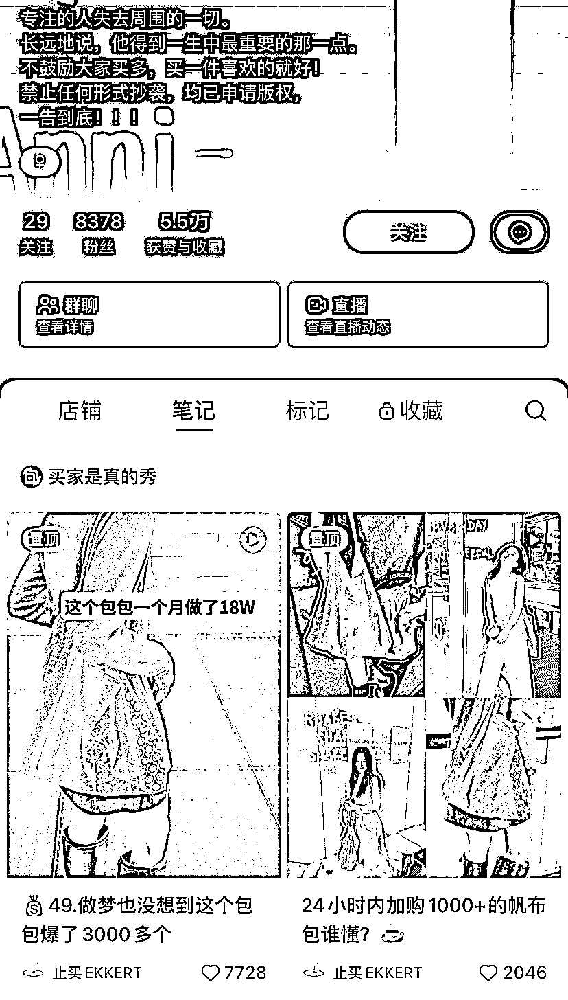
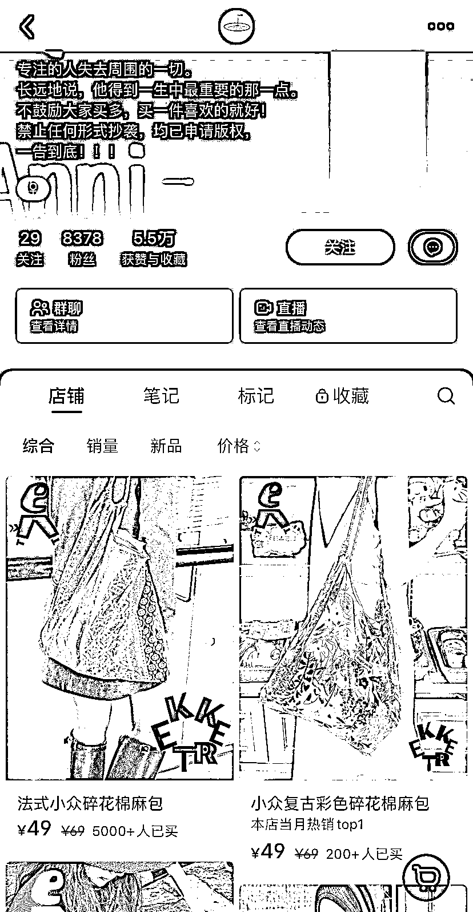
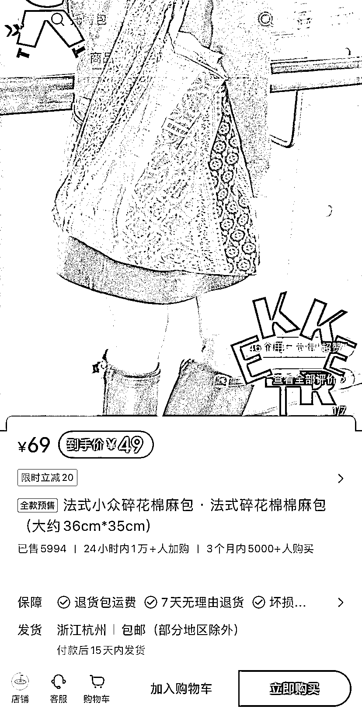

# 独立设计品牌的风向标：坚持在小红书上发布笔记，带来近 6000 单销量

> 原文：[`www.yuque.com/for_lazy/xkrm14/kpct4n0h97layf3h`](https://www.yuque.com/for_lazy/xkrm14/kpct4n0h97layf3h)

作者： 陈去野

日期：2024-02-26

点赞数：**37**

* * *

正文：

独立设计品牌一定要坚持做小红书 一篇笔记爆了之后带来将近 6000 单

* * *

评论区：

* * *

公众号懒人搜索，懒人专属群分享