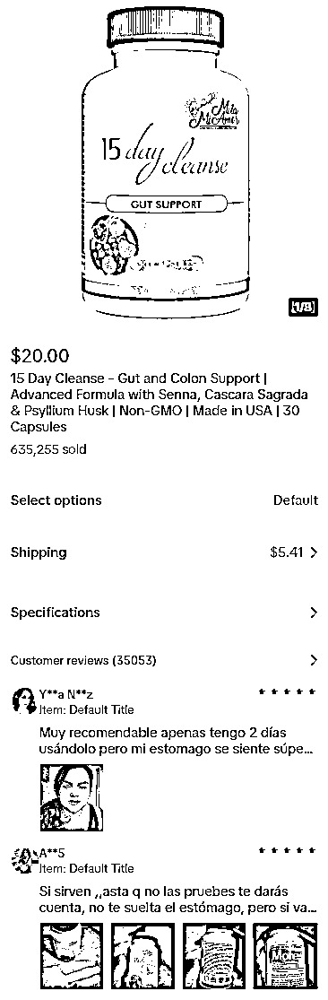
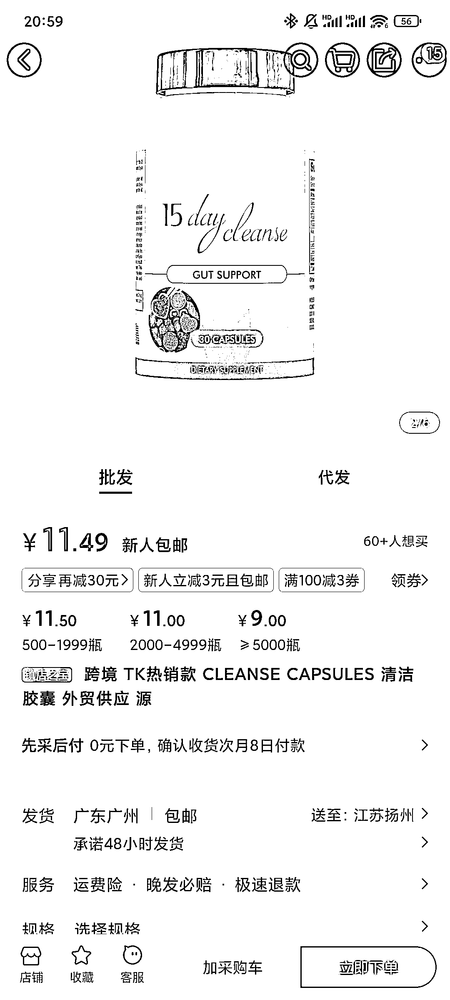

# TikTok 店铺卖货：融肠胶囊成为爆品，销售额超过 1200 万美元

> 原文：[`www.yuque.com/for_lazy/xkrm14/ey94a6w4vmxuv3oe`](https://www.yuque.com/for_lazy/xkrm14/ey94a6w4vmxuv3oe)

作者： 万航宇

日期：2024-02-27

点赞数：**37**

* * *

正文：

平台和项目：TikTok 店铺卖货 新的选品：融肠胶囊（我理解的就是健胃消食片的作用）
盈利空间：阿里巴巴 11.49 一瓶，买的多就是 9 块钱一瓶，卖到美国 20 美元一瓶，这种爆品可以备一部分到海外仓，虚拟仓对店铺风险大，而且物流成本比较高。
这个店铺已经卖了 635255 件了，主要是达人带的销售额，基本上每个达人带都是 10 万以上的销售额。20 美金一瓶，一共就是 1200 多万美金了！这个店铺还开了运费，也就是说又撸了一手官方的运费补贴！

* * *

评论区：

Yaohz : 有资质要求吗

万航宇 : 应该有的，我没做这个类目。不过看阿里巴巴很多同样产品销量，那就说明别人有办法解决的，研究研究就可以。我看有的店铺说了这个产品只卖国外，感兴趣也可以联系一下商家之类的，可能商家那边能提供一些资料的。没有的话就只能非常规手段了[机智]

Yaohz : 好的好的感谢[玫瑰]

* * *

公众号懒人搜索，懒人专属群分享