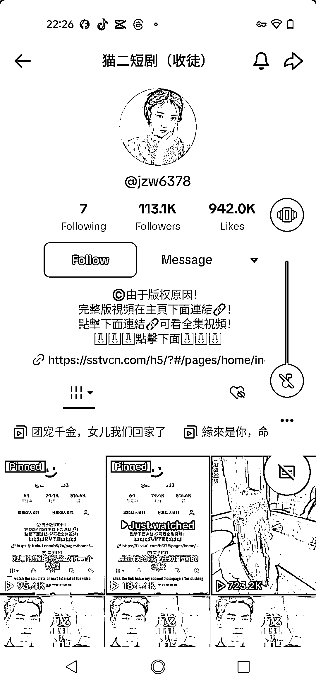

# 通过 TikTok 国内中文短剧引流和广告变现的方法

> 原文：[`www.yuque.com/for_lazy/xkrm14/pqe1cn0zvg37ftdb`](https://www.yuque.com/for_lazy/xkrm14/pqe1cn0zvg37ftdb)

作者： 平凡

日期：2024-03-01

点赞数：**71**

* * *

正文：

赛道+垂类项目：tiktok 国内中文短剧，通过主页链接和置顶视频引导自研的网站。避免的版权问题，引流还有广告变现。
直接国内的抖音视频直接发布到 tk，剪辑成本低，但发现受众群体很大，一个粉丝 11w，观看量都是 30w 以上，有的上百 W，评论区很多都是在喊更，这些都可以引流到私域。除了这个之外，还可通过收徒，赚取相关费用。

* * *

评论区：

小马哥 xy50 : 需要海外短剧资源进行短剧剪辑可以私我

平凡 : 授权还是推广？

小马哥 xy50 : 推广

副本怪 : 哥，怎么私你呢？最近在找项目搞钱

爱拼才会赢 : 有微信吗

小林 : 怎么联系

小马哥 xy50 : baojie_xmg

* * *

公众号懒人搜索，懒人专属群分享