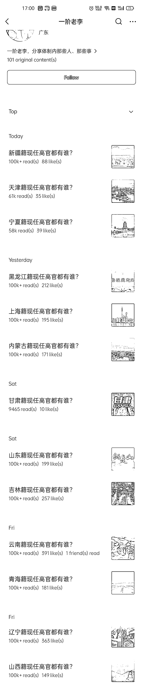

# 公众号揭秘公务员内部高层，按地域整理，每篇阅读量 10 万+

> 原文：[`www.yuque.com/for_lazy/xkrm14/arv5s95ppfcf0xuc`](https://www.yuque.com/for_lazy/xkrm14/arv5s95ppfcf0xuc)

作者： Allan

日期：2024-02-26

点赞数：**105**

* * *

正文：

公众号的一个新号，几乎每一篇都是 10 万➕ 选题角度很不错，公务员内部的高层，按地域进行整理

* * *

评论区：

浪久 : 好奇问问，为啥部分是英文呢

李半文 : 微信语言或者手机本身设置就是英文的，你试试，应该也可以

浪久 : [抱拳]

Denggh : 这流量太离谱了

闫君 : 明天我用视频给你测一下流量

仰仰 : 很好奇这类流量怎么会爆[呲牙]

大侠 : 选题很新颖独特，就想知道里面介绍的官员，有露脸图片，万一过了一段时间落马了，是不是图文信息要删除或者隐藏。

* * *

公众号懒人搜索，懒人专属群分享