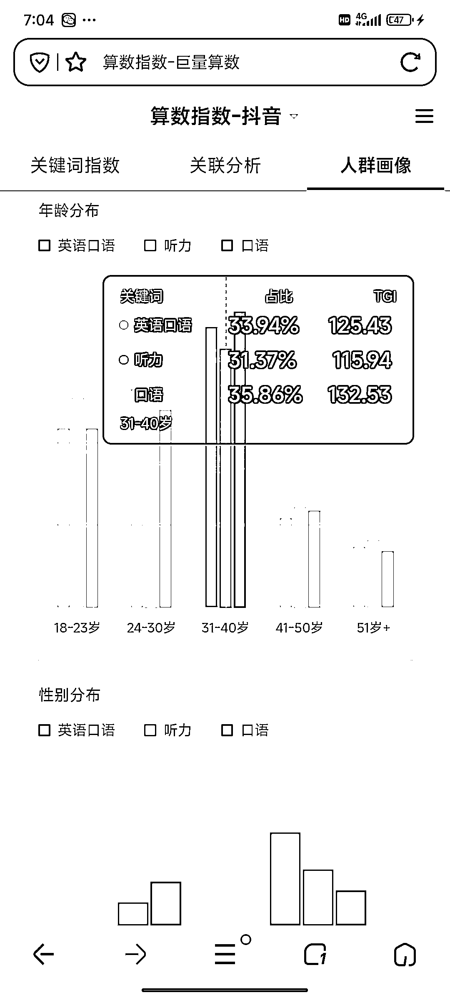

# 利用视频引流，打造英语口语课程，吸引 30-40 岁的学习者

> 原文：[`www.yuque.com/for_lazy/xkrm14/dvgdd8c2cf00uug3`](https://www.yuque.com/for_lazy/xkrm14/dvgdd8c2cf00uug3)

作者： 乐天

日期：2024-02-28

点赞数：**71**

* * *

正文：

英语口语课程引流视频玩法 目标人群：想提升英文水平的人，巨量指数平台看需求最大的应该是 30-40 岁的人。 需求：想通过线上课程提升英文水平
平台和项目：视频号剪辑国外综艺片段，加上标题字幕吸引人来看。通过做直播加企微，卖英文课程，转化对英文学习感兴趣的人。
盈利空间：目前看销量已经过 2w，客单价基本在 300 左右，如果后续还有升单其他课程，客单价会更高

* * *

评论区：

快乐柠檬 : 这个需要主播露脸讲解吗？还是纯剪辑，卖的也是别人的课

乐天 : 你可以视频号搜索看下

* * *

公众号懒人搜索，懒人专属群分享