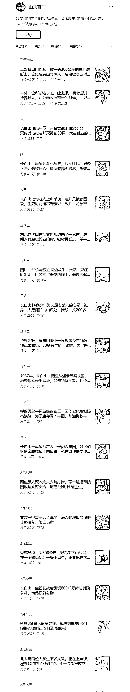

# 独特视角的公众号：揭秘野生动物的残酷天性

> 原文：[`www.yuque.com/for_lazy/xkrm14/frhot3lelk42geob`](https://www.yuque.com/for_lazy/xkrm14/frhot3lelk42geob)

作者： 苓枫

日期：2024-03-01

点赞数：**113**

* * *

正文：

公众号流量主 刷到一个独特视角的公众号，不知道是不是圈友的，流量很稳定，几乎每一篇都破万阅读，10w➕文章也很多
1.选题角度很新颖，分享动物之间的恩恩怨怨，揭秘野生动物的残酷天性。 2.同质化低，不会动不动就被判滥用原创声明
3.写文思路广，就属动物群体是最多的，天上飞的，地上走得，水里游的，囊括世间万物

* * *

评论区：

Hearty : 请问 10w+一篇能产生多少广告费？

苓枫 : 这个不确定的，流量主收益和阅读率，完读率还有 ecpm 值都有关系，我自己的号 8w 阅读就有 400 多

苓枫 : 谢谢老大！3 月第一次中标，争取再中第二次

Hearty : 谢谢！

* * *

公众号懒人搜索，懒人专属群分享