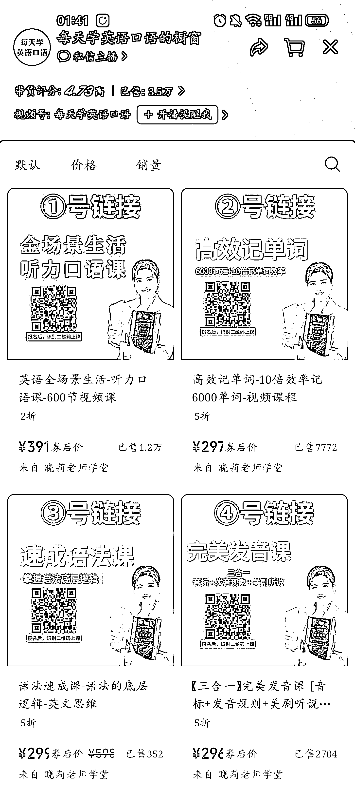
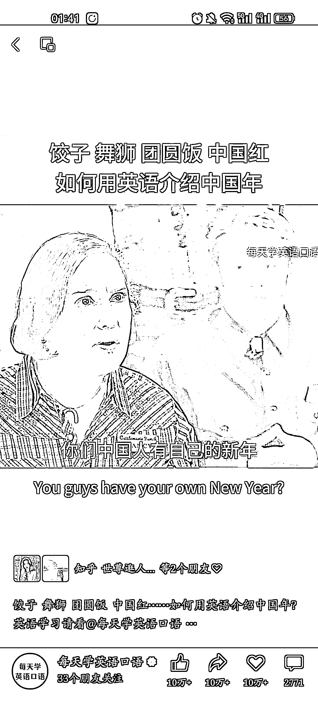
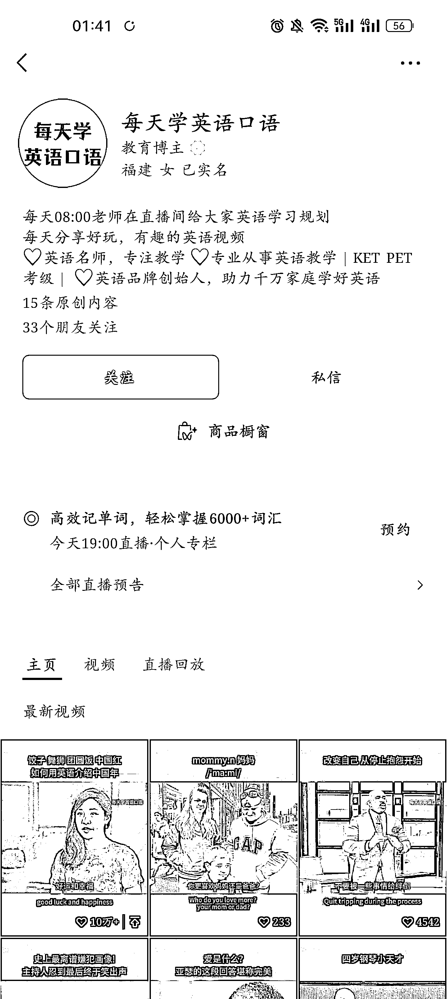

# 利用视频号吸引英语爱好者，教育赛道可入局

> 原文：[`www.yuque.com/for_lazy/xkrm14/owro8q0pa4buiws7`](https://www.yuque.com/for_lazy/xkrm14/owro8q0pa4buiws7)

作者： 韩北樱

日期：2024-03-01

点赞数：**70**

* * *

正文：

视频号可以剪辑国外综艺或电影片段，吸引对英语感兴趣的人。
看了下橱窗，客单价 391 元的课程，销售量 1.2w，其他课程转化率也很高，说明视频号人群画像还是符合的，教育赛道可入局。 两种转化变现模式：
1.视频号橱窗/直播带货卖基础低客单价课程 2.加微信，引流到私域里面，转化高客单价。

* * *

评论区：

夏暮 : 我这两天也刷到过这个视频号

雁南飞 : 这个销量应该是也包括了其他号卖的

* * *

公众号懒人搜索，懒人专属群分享