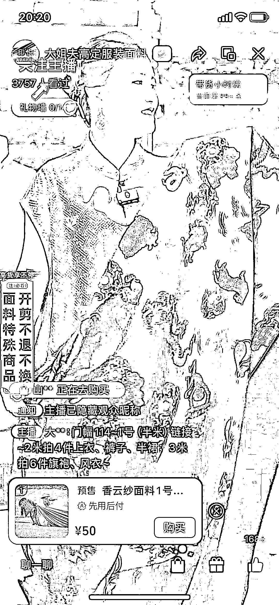
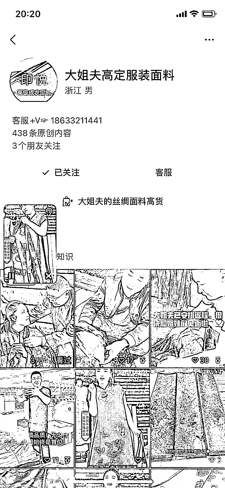
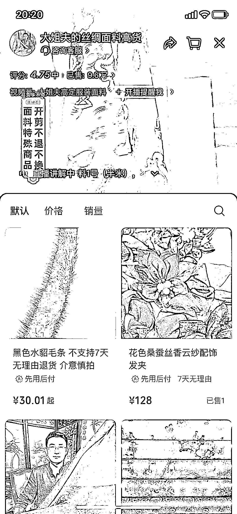
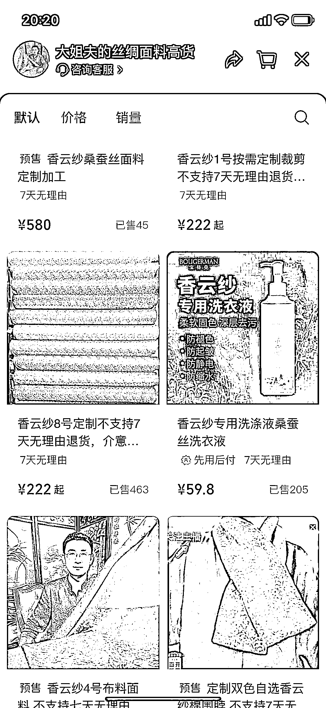

# 中老年人喜欢中式服装，视频号卖香云纱面料满足需求

> 原文：[`www.yuque.com/for_lazy/xkrm14/ai0at65guogo20be`](https://www.yuque.com/for_lazy/xkrm14/ai0at65guogo20be)

作者： 听佰

日期：2024-02-29

点赞数：**36**

* * *

正文：

赛道+项目：视频号卖香云纱面料 目标人群：喜欢中式服装、旗袍的中老年人
需求：线下香云纱成品服装一般都要大几千一件，但线上买面料再去找裁缝定制，可以省下不少，而且款式花型多样，也能满足体型富态的老年人需求
盈利空间：橱窗整体销售 9.6 万单，0.5 米面料售价 50 元，定制一件衣服需要 2-3 米，不同面料款式售价不同，半米 50 元是普通面料价格，看橱窗里还有多种香云纱周边，客单价都很高

* * *

评论区：

* * *

公众号懒人搜索，懒人专属群分享