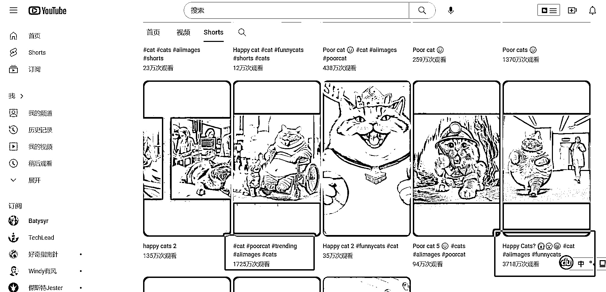
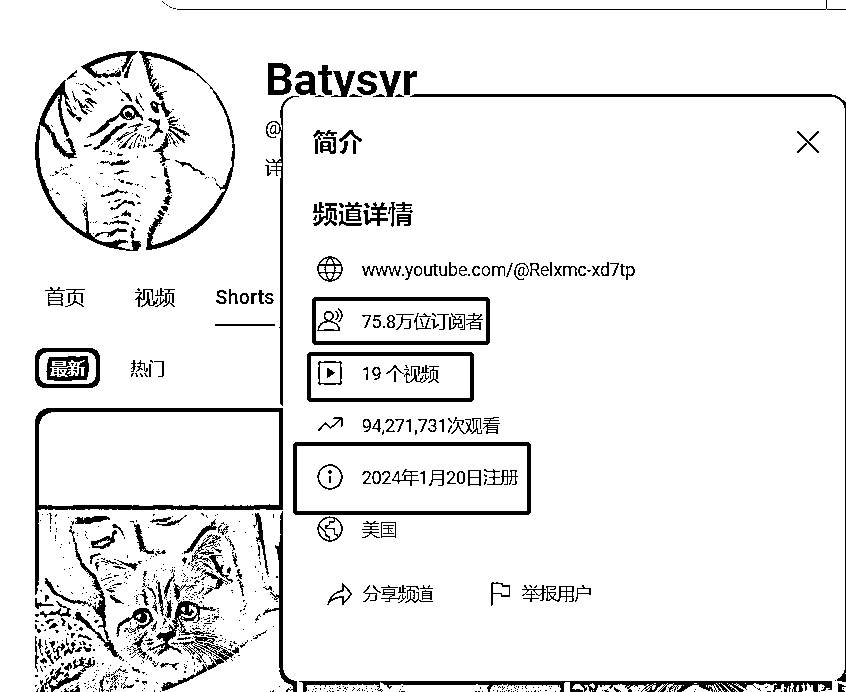
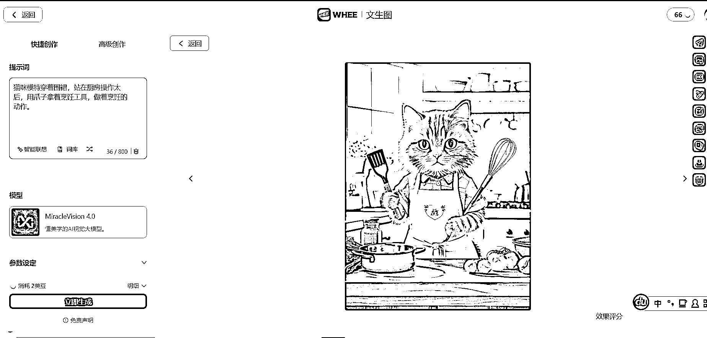

# AI 制作猫咪剧情短片爆红网络，视频生成工具推荐

> 原文：[`www.yuque.com/for_lazy/xkrm14/sw1gtm1ne4keyspy`](https://www.yuque.com/for_lazy/xkrm14/sw1gtm1ne4keyspy)

作者： 仰仰

日期：2024-03-01

点赞数：**199**

* * *

正文：

最近 Short 短视频上面一位用 AI 制作猫咪剧情短片爆红网络，不到两月涨粉到 75W+。一条视频播放量超过 3000W+，制作视频使用 AI 工具加关键词即可生成。目前小红书，抖音等短视频平台有少部分人涉足，小红书上一位博主通过接广、收徒的方式进行变现。具体制作可以使用 Chatgpt、文心一言等工具生成关键词，使用 AI 工具生成图片，你可以在原有图片的基础增加一些新意，使用 AI 工具转换为动图，提升变现能力。
推荐一个好用的视频生成工具：www.whee.com（美图秀秀旗下工具）

* * *

评论区：

仰仰 : 指令格式： 你的角色是“专业的小红书运营” 背景：目前你正在运营一个像人类一样的猫咪分享穿搭的账号，账号内容是猫咪模特分享穿搭
注意：这些猫咪需要使用双脚站着走路，而且做着类似人类的行为，比如健身、烹饪、钓鱼等日常生活行为
需要制作的内容有 3 部分：图片、标题、文案需要你提供图片描述、标题和文案，用表格的形式给我

观察者 : Whee 确实不错，值得推荐。

理想三旬 : YouTube 怎么变现呢

仰仰 : 主要是广告收益，播放量越高，广告收益越多

极品酸梅汤 : 很好奇，他每个视频的音乐，都用“喵喵喵”代替了歌词，不知是如何做到？

刘继春 : 小红书也有类似的账号

仰仰 : 对，小红书有人都开始变现了，收徒 199[偷笑][偷笑]

仰仰 : 墙外现在好多人使用这个音频[微笑][微笑]

* * *

公众号懒人搜索，懒人专属群分享