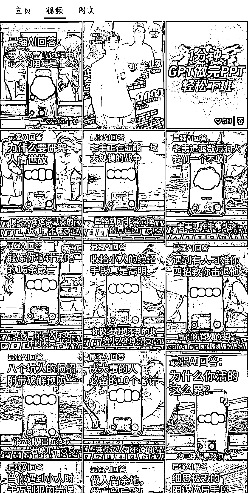
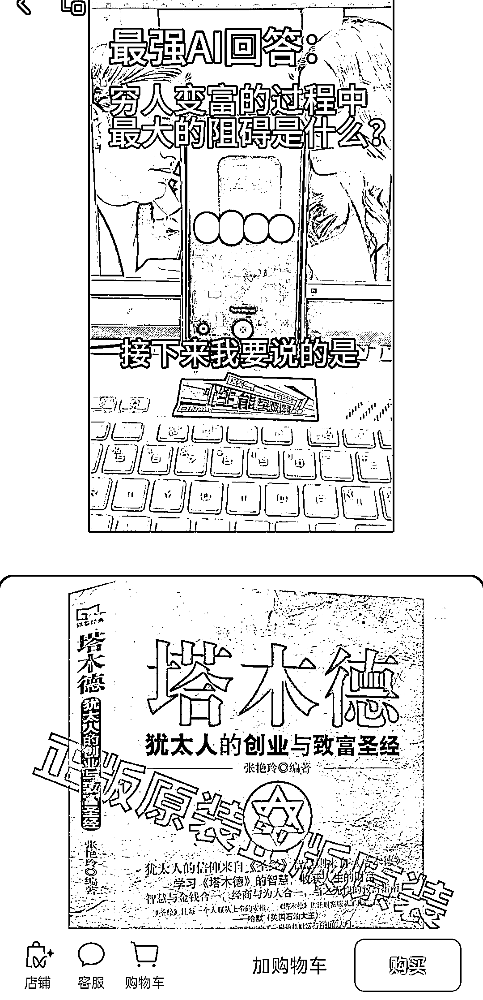

# AI+拆书：视频号发布最强 AI 回答视频，推荐书籍并实现无人带货卖书

> 原文：[`www.yuque.com/for_lazy/xkrm14/uy50kwf0ly92dguu`](https://www.yuque.com/for_lazy/xkrm14/uy50kwf0ly92dguu)

作者： 晓阳

日期：2024-02-29

点赞数：**80**

* * *

正文：

赛道＋垂类项目:AI＋拆书 视频号发布最强 AI 回答视频，话题选择围绕书籍展开，AI 语音回答推荐书籍，挂橱窗卖，不用真人出镜带货卖书，还有 AI 当背书。
#风向标

* * *

评论区：

梧桐树 : 厉害，学习

华龙 : 厉害，这个带货 7000 多，不知道是不是这类视频出的单

深圳阿岳 : 晓阳，请问这个 AI 回答的软件是什么呀？

蕉太狼 DP : 看样子像是 GPT4

深圳阿岳 : 感觉这个回复不像是 gpt 回的，是提前置入的文字吧？

华龙 : 文字是 GPT 输出的，然后后期配音剪辑的。AI 应该还没强大到如此语音输出

曦演 : OpenAI 有个 Whisper 模型，可以把指定的文字转成语音。这个可能是用了一段视频循环播放，然后把做好的语音加到了视频里

* * *

公众号懒人搜索，懒人专属群分享