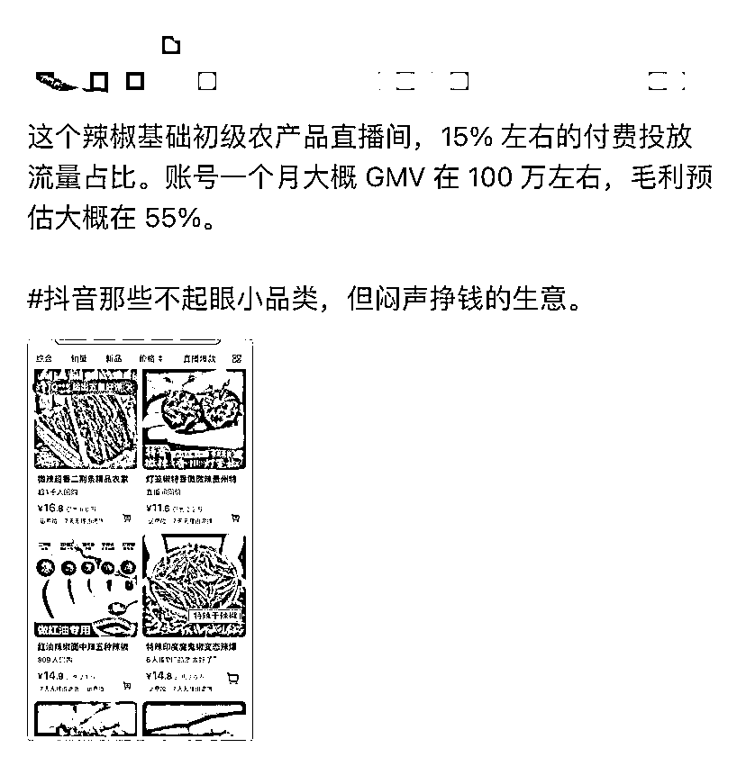

# 抖音那些不起眼小品类，但闷声挣钱的生意

> 原文：[`www.yuque.com/for_lazy/xkrm14/qzpidz39eh10x9to`](https://www.yuque.com/for_lazy/xkrm14/qzpidz39eh10x9to)

作者： 罗破帽

日期：2024-02-27

点赞数：**41**

* * *

正文：

抖音那些不起眼小品类，但闷声挣钱的生意。这个辣椒基础初级农产品直播间，15% 左右的付费投放流量占比。账号一个月大概 GMV 在 100
万左右，毛利预估大概在 55%。

* * *

评论区：

快乐柠檬 : 请问怎么看它投流占比？

* * *

公众号懒人搜索，懒人专属群分享