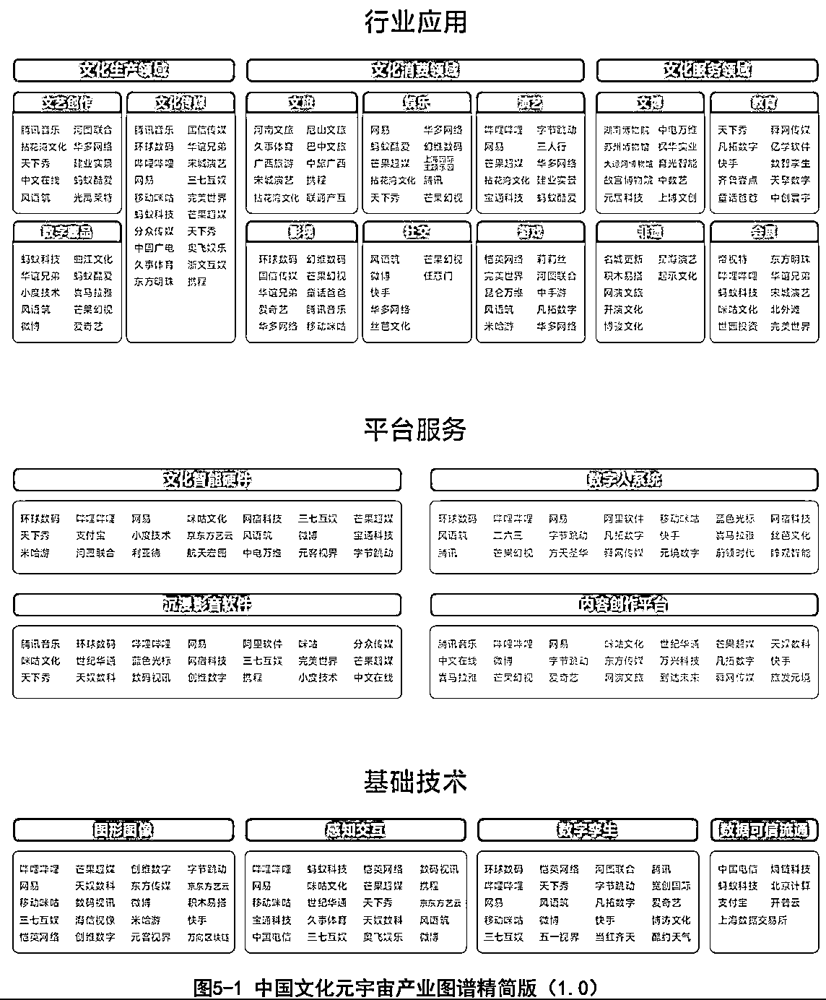
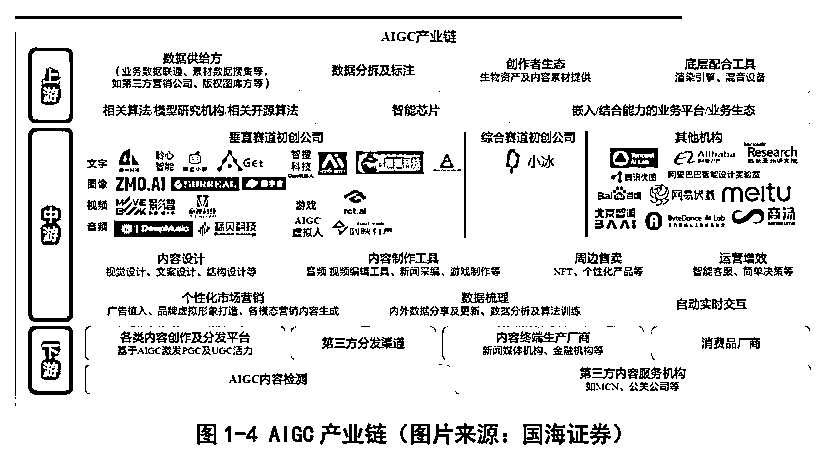
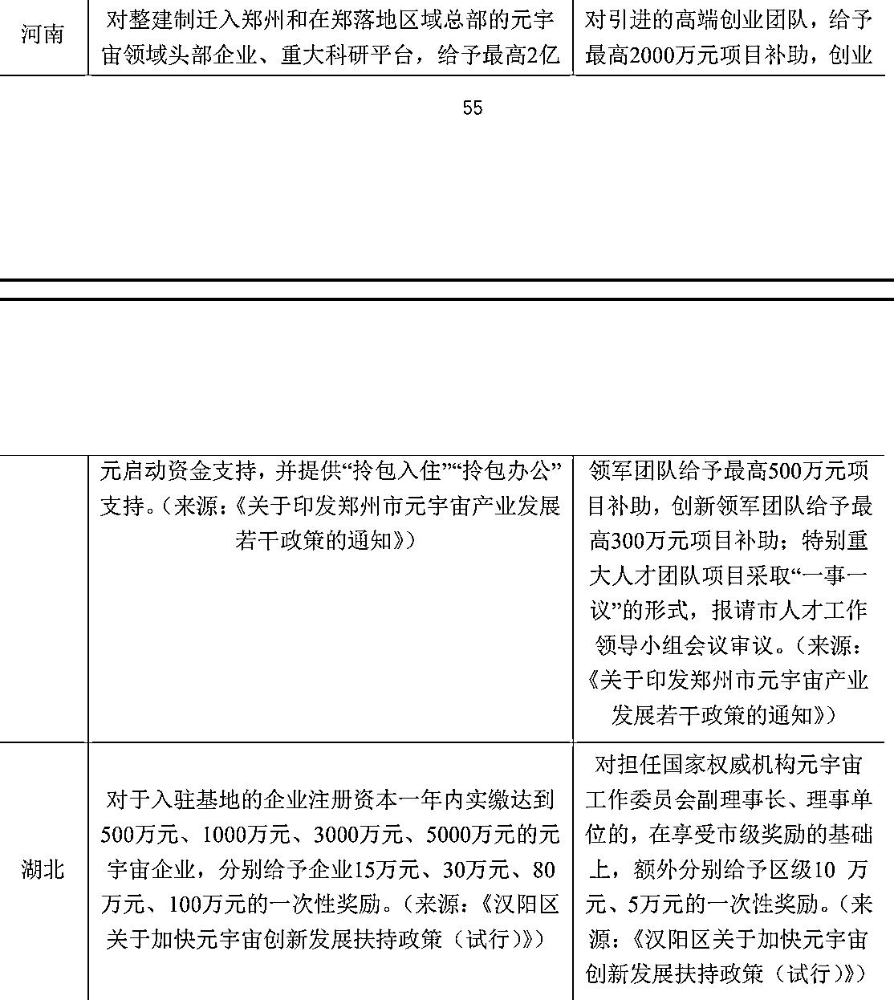
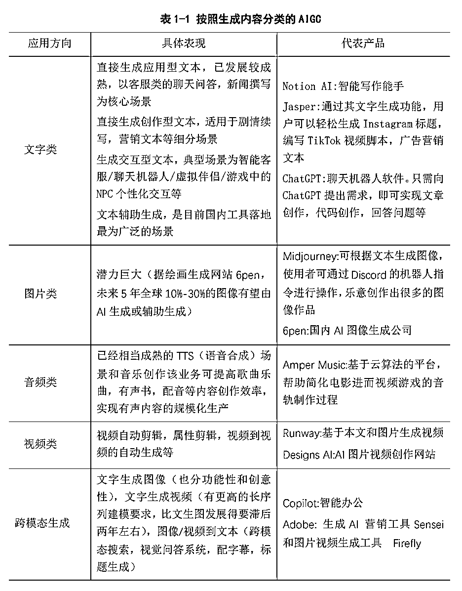

# 《中国文化元宇宙白皮书》：全面梳理发展现状与趋势

> 原文：[`www.yuque.com/for_lazy/xkrm14/xfkxprqyxg36z9gw`](https://www.yuque.com/for_lazy/xkrm14/xfkxprqyxg36z9gw)

作者： Yang

日期：2024-02-28

点赞数：**82**

* * *

正文：

最近刷到《中国文化元宇宙白皮书》全文，去年年底发布的，全国 20 余所高校 26 位教授、129
位专家学者共同编撰完成，对中国文化元宇宙在各行业的发展做了个梳理，有政策，有案例，AICG 和 Web3.0 有专门的章节，可以对“元宇宙”概念有个较为完整的了解

* * *

评论区：

* * *

公众号懒人搜索，懒人专属群分享