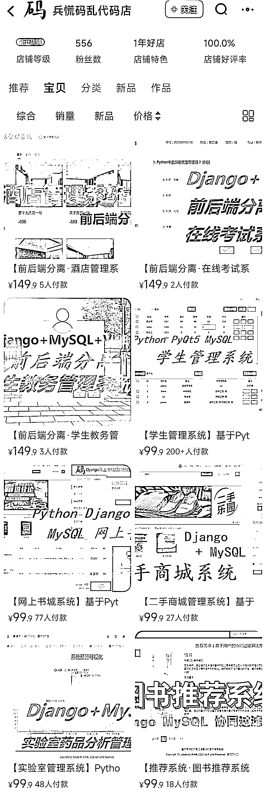
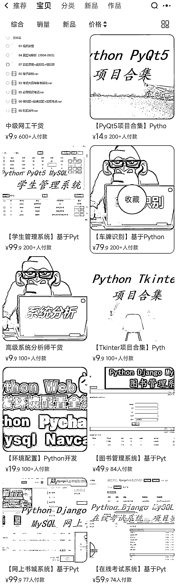
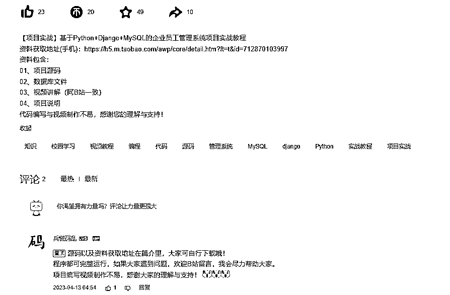
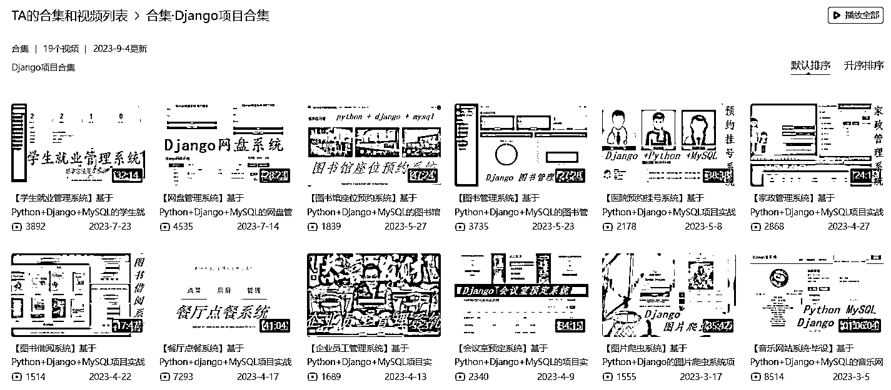
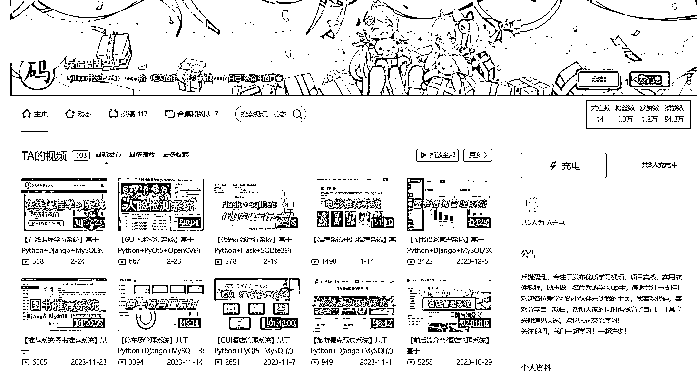
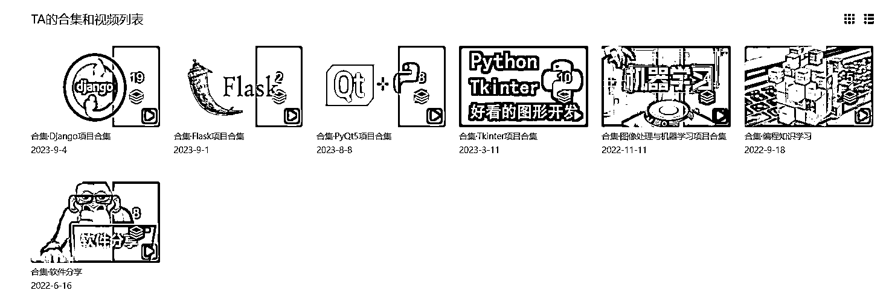

# 如何高价销售编程资料类虚拟产品

> 原文：[`www.yuque.com/for_lazy/xkrm14/wufr8gp4id3yotcu`](https://www.yuque.com/for_lazy/xkrm14/wufr8gp4id3yotcu)

作者： 北柱

日期：2024-02-29

点赞数：**68**

* * *

正文：

如何高价卖出编程资料类虚拟产品？切中计算机相关专业大学生毕业设计需要系统开发完成疼点，发布演示系统并在视频下方留下淘宝店铺链接。
XX 系统实战，XX 项目，附源码，吸引目标用户，视频演示系统功能➕实现过程，淘宝店铺出售源码资料，B 站万粉也能通过虚拟产品变现。

* * *

评论区：

东兴 : 你好，大佬 卖这个有侵权风险吗？如果有的话，该如何避免呢？

高财生 : 同问，一般资料类的特别 IT 有强风险

想和她进入元空间 : 这个东西买了之后感觉都是当个模板，进行修改实用的

北柱 : 是啊，用户看了视频觉得适合自己满足需求就有可能前往淘宝店铺购买，之后可以直接使用或者修改后使用

北柱 : 我也不是很清楚，没有这方面的经验，看看有没有圈友解答一下吧。

斌斌 : 1.毕设代码不查重，买过来稍微改一下，就可以用，几十块买过来，换个样子，可以 1000 多卖出去，很简单
2.这个代码都是定制的，定制代码的学生毕设通过后，原作者可以一直卖这个代码。 3.这种代码网上都能找的到。 4.做毕设这块，利润很大

北柱 : [强]

* * *

公众号懒人搜索，懒人专属群分享