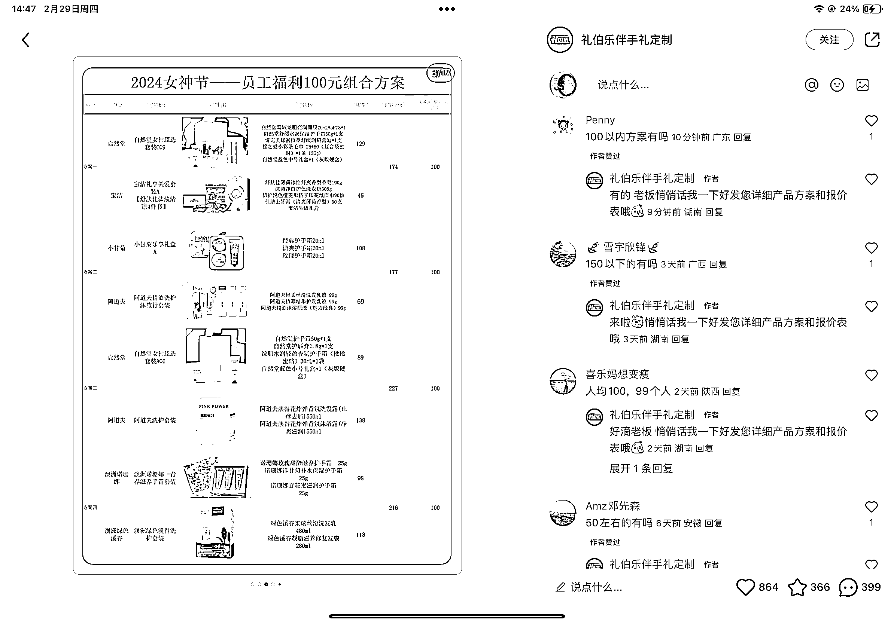
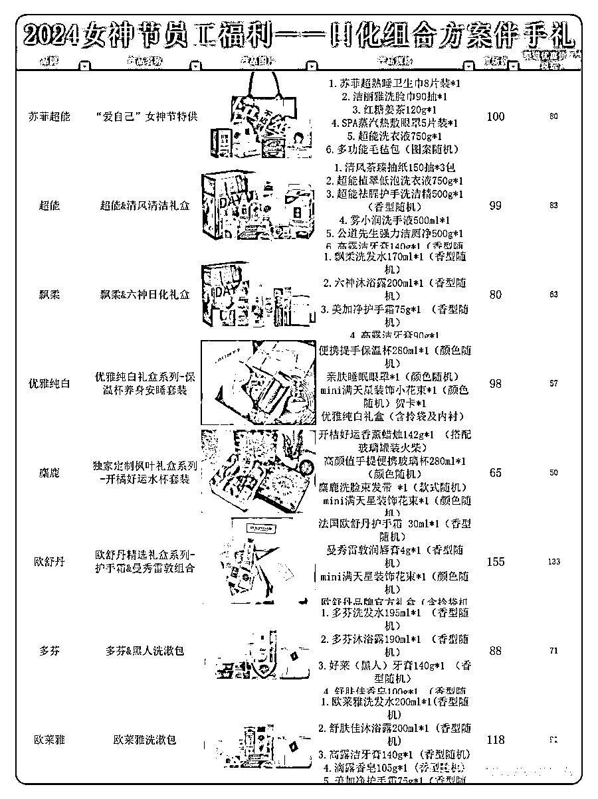
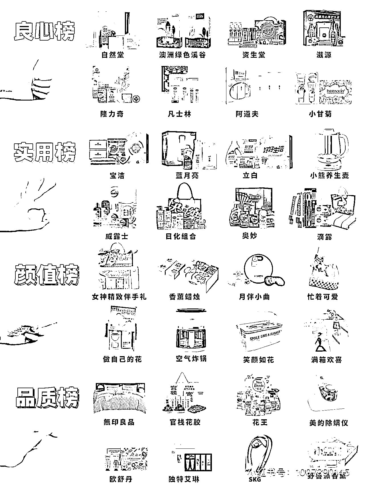
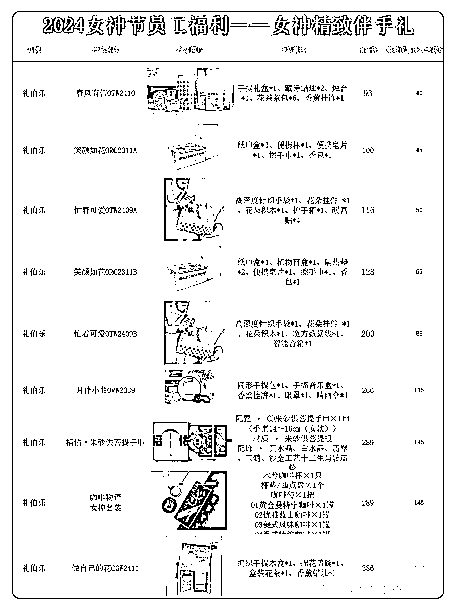
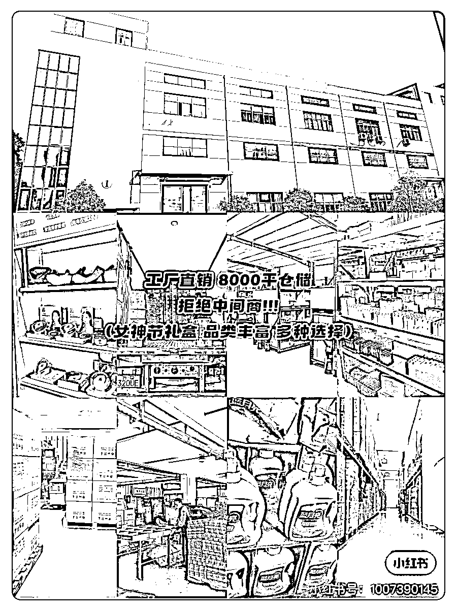
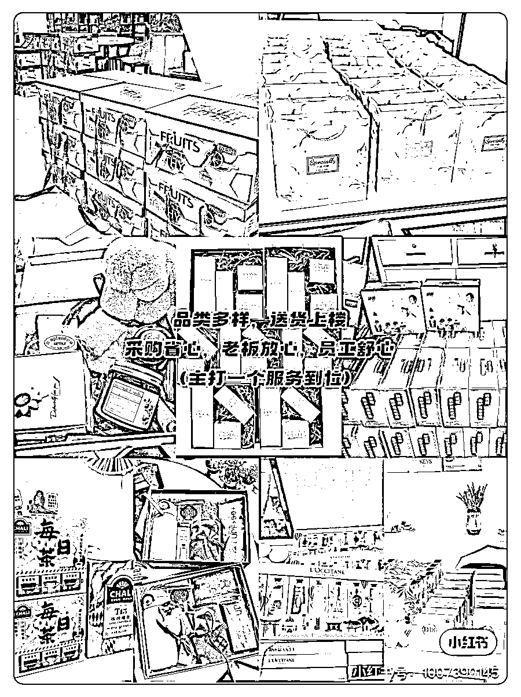

# 本地生活团购平台，为中小企业提供优质礼品搭配服务

> 原文：[`www.yuque.com/for_lazy/xkrm14/amvbpz64rbdf0ezr`](https://www.yuque.com/for_lazy/xkrm14/amvbpz64rbdf0ezr)

作者： 薄荷 Heidi

日期：2024-02-29

点赞数：**56**

* * *

正文：

本地生活团购 目标人群：专注中小企业优质礼品搭配的 HR 或采购部门 需求：在预算范围内搭配出性价比高又多样的礼品，且最好是有品牌的不烂大街的礼品套装
平台和项目：在小红书，新号，2 个月，涨粉 4000+，发布各类团购价格的食品礼盒，家电礼盒，美妆护肤礼盒，洗护礼盒，生活家居礼盒，女神精致伴手礼，香薰家纺礼盒，日化组合方案伴手礼内容，来引导用户到私域，发产品方案和报价表，以及搭配礼品服务。
盈利空间：最近三八节女神节私信她的客户，私域成交应该不低。
目标用户够垂，公司团购数量不低，可选择性多，懒人搭配，还有团购价，可印公司 logo，成交金额肯定不低。

* * *

评论区：

时光 : 首先货源怎么解决啊 这种如果没有货源 不好做吧、

* * *

公众号懒人搜索，懒人专属群分享