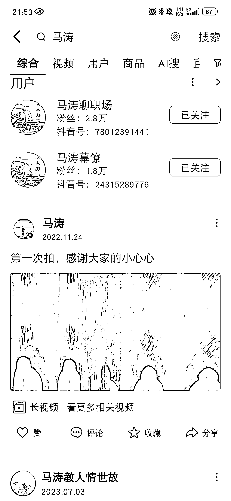
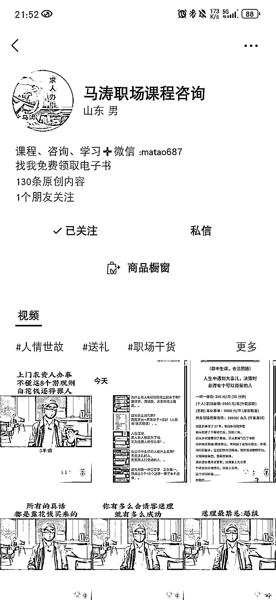
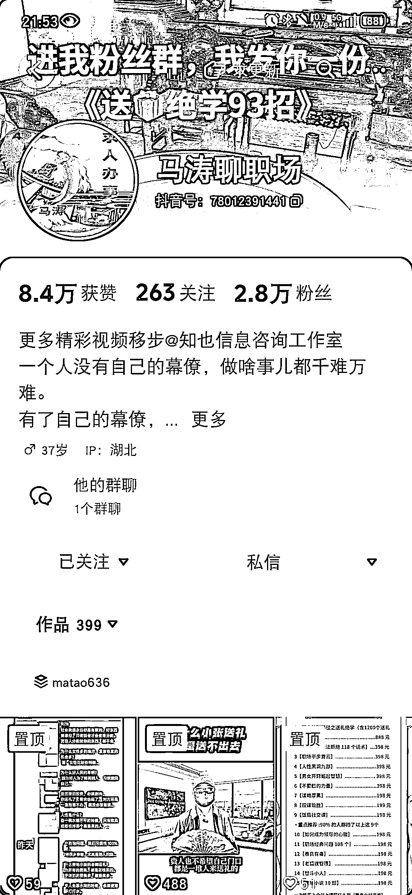
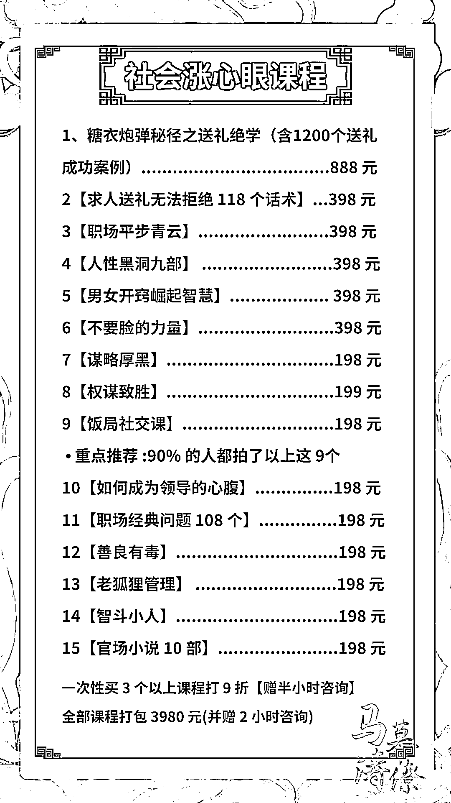
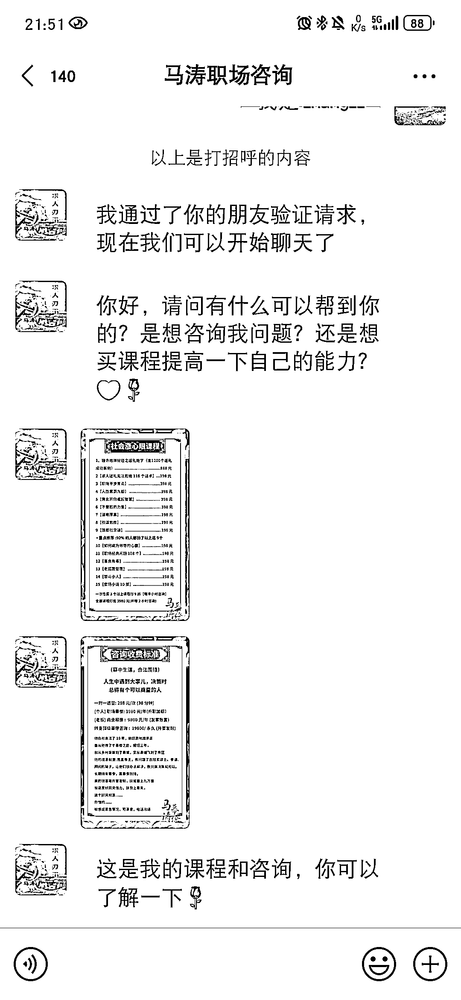
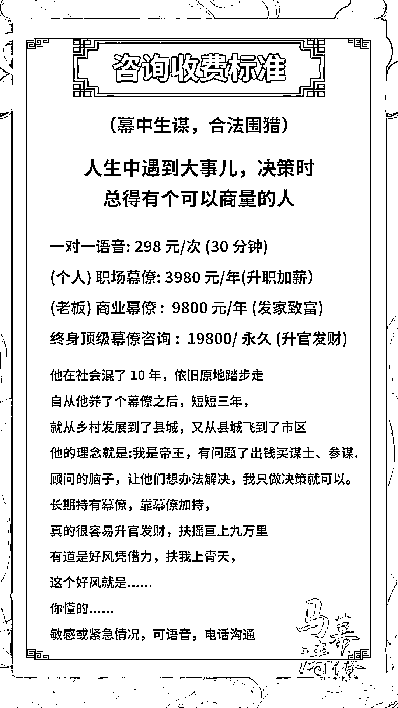
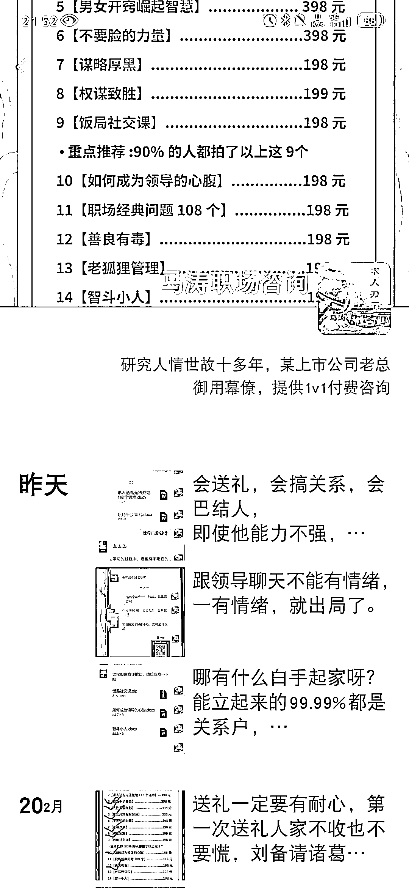
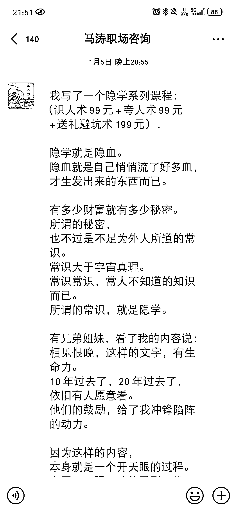
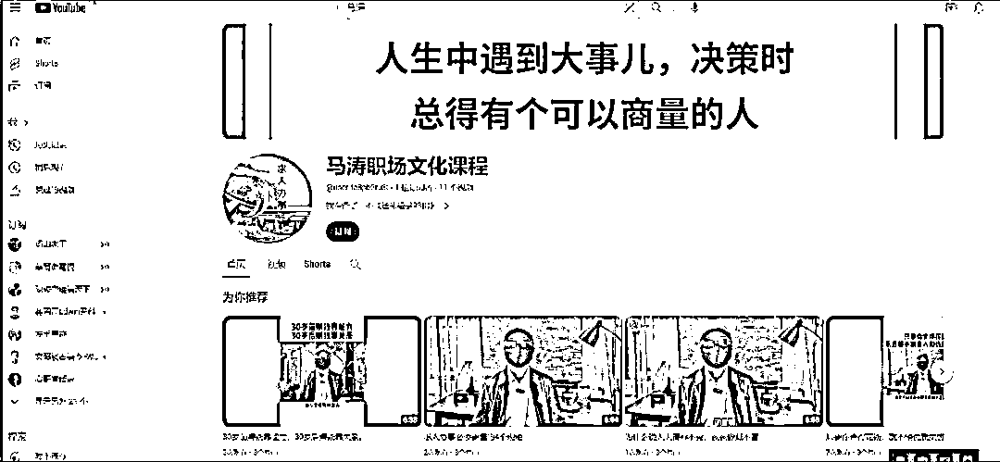

# 探索“送礼”项目的变现方式和市场需求

> 原文：[`www.yuque.com/for_lazy/xkrm14/azmtsqh0s42fpu0n`](https://www.yuque.com/for_lazy/xkrm14/azmtsqh0s42fpu0n)

作者： 张工

日期：2024-02-26

点赞数：**51**

* * *

正文：

前一阵因为有事涉及到重要“”人脉“”送礼”相关，就到几个平台搜索了一下，加了视频号其中一个马涛职场咨询【见图 2】。
通过进一步交流，他们大概提供 198 元至 888 元课程，经了解他们提供的课程文档【见图 4、5、6】。
于是按照咋们学的生财有术思维，找其它淘宝、咸鱼等平台，但买不到类似资料，因为这类课程资料基本私域成交，所以一些资料贩子没有相关资料。【经了解，这些内容大致是利用信息差，将各种信息整合，二次原创】。
另外他们还提供一对一价格不等的职场和商业类咨询，最高客单价所谓的幕僚：19800。【见图三】。
于是又大致在抖音平台【图 1、3】，外网油管【图 9】等大致搜索，各个平台账号都有频繁的更新视频，部分内容流量都不错，说明市场需求较大，推测这个项目变现也比较客观。
另外，平时看了一下他们的朋友圈文案，写的有一定水平，确实能提供一些有用信息。
另外也又搜索其它同类型的账号，很多产品，变现方式都类似。有些还会做职场等类别收费社群变现。
这一类项目，对体制内，国企事业内等人群有该类需求，应该是有可管变现。
圈友们可以参考一下这类“送礼”，“幕僚”，“职场咨询”等类型项目，他们是如何做产品，定价，流量渠道，以及私域运营等相关#风向标#视频号#抖音#“送礼”项目

* * *

评论区：

张工 : 谢谢亦仁懂事长[呲牙]

* * *

公众号懒人搜索，懒人专属群分享