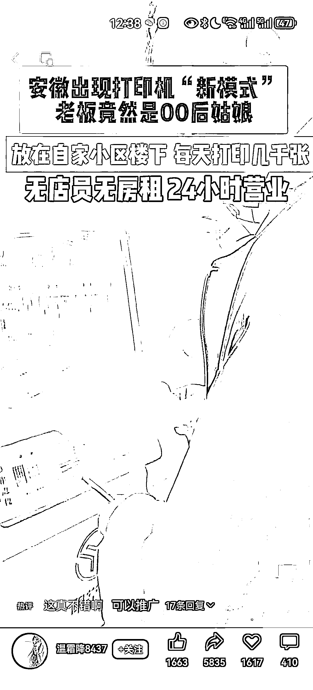

# 小区开设 24 小时无人看守打印机店，满足学生打印需求

> 原文：[`www.yuque.com/for_lazy/xkrm14/iof5vn8en241sk7c`](https://www.yuque.com/for_lazy/xkrm14/iof5vn8en241sk7c)

作者： 浩瀚星辰

日期：2024-03-01

点赞数：**55**

* * *

正文：

#风向标# 小区里开设 24 小时无人看守打印机店 目标人群：有需求的所有人群
需求：现在的学校布置很多的需要自己打印的作业，特别是初高中，但是很多人家里并不会买打印机，去打印店打的都很贵（五毛到一元），24 小时营业无人值守😌降低成本，低价抢占市场。一天打印一千张问题不大，临近大小考打印会更多。

* * *

评论区：

Nicole : 选啥品牌比较好呢

北封 : 从小学开始，打印机就是必备的了[尴尬]

may : 微信里有个线上打印小程序（之前圈友推荐的），价格比门店便宜啊！直接在小程序设置好打印页数，明天直接送上门，我打印过，挺方便的，也实惠。

大美 : 我是直接在淘宝上打，不过我这种对时效性要求不高，可能不是一样的需求群体

颜乐乐 : 叫啥

刘同学 : 小猿云印

* * *

公众号懒人搜索，懒人专属群分享