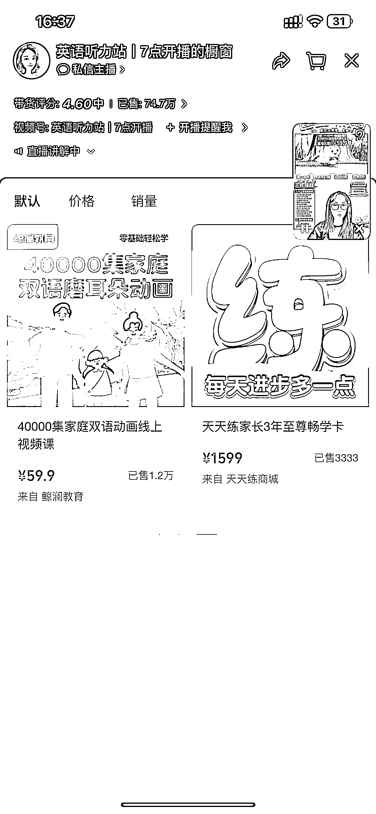

# 幼儿英语学习资料销售，盈利空间大，引流方式值得尝试

> 原文：[`www.yuque.com/for_lazy/xkrm14/mvoac9ahu0t2wq2l`](https://www.yuque.com/for_lazy/xkrm14/mvoac9ahu0t2wq2l)

作者： 宇星

日期：2024-02-27

点赞数：**53**

* * *

正文：

#风向标
视频号：卖幼儿英语学习资料。直播+短视频售卖幼儿英语学习视频。真人出镜+绿幕背景。之前做过幼儿英语的市场运营，家长从 3 岁就开始送过来学英语。“双减”后就很少了，现在政策稍微放宽点了，感觉可以尝试下
盈利空间：59.9 元 4 万部英语动画片。百度网盘下载。边际成本极低。而且本身绿幕直播间对设备要求很高，但看这画质应该用的设备挺简单的。关键她一年多时间带货单数 74.7 万！
思维拓展：和上午了解的小学资料#风向标，有异曲同工之处。所以不管是学龄前后，还是成人的学习资料，找到引流方式，这种项目真的不要太香。

* * *

评论区：

快乐柠檬 : 这个片子有没有版权的？

* * *

公众号懒人搜索，懒人专属群分享