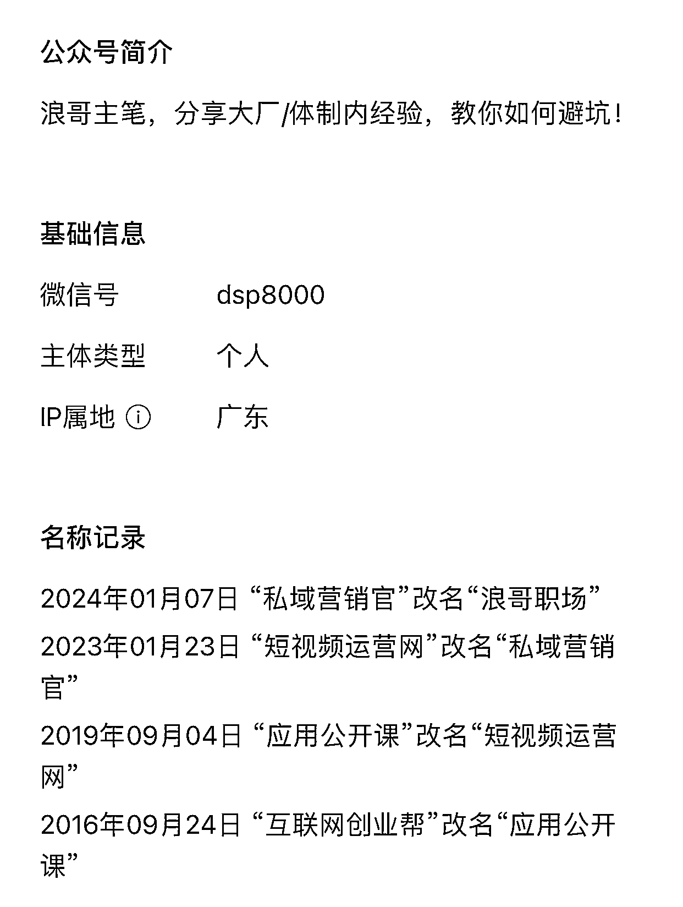
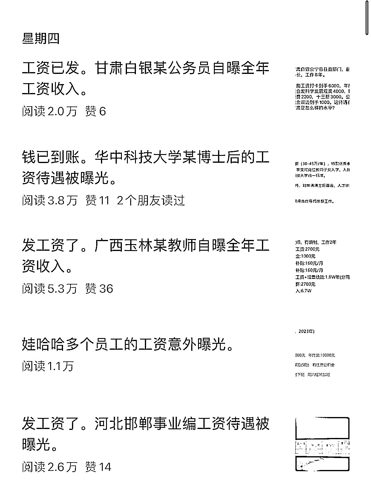

# 拦截关键词，写公众号爆文的流量思维

> 原文：[`www.yuque.com/for_lazy/xkrm14/hpxg79bvdpf8t4b4`](https://www.yuque.com/for_lazy/xkrm14/hpxg79bvdpf8t4b4)

作者： 林林 AIGC 写作

日期：2024-03-11

点赞数：**86**

* * *

正文：

写公众号爆文真不能没有流量思维，否则这个账号也不会用“拦截”的方法成功蹭上热度。
例如像这个在今年 1 月 7 日才开始重新运营的职场类公众号，在上周四（3 月 7 日）出现了 5 篇爆款。
在我看来，这 5 篇小爆款之所以能火起来，是因为标题精准“拦截”了一些关键词。比如像甘肃白银、华中科技大学、广西玉林、娃哈哈、河北邯郸，这几个涵盖单位名称与地名的关键词的背后，其实也隐藏着不少网友的需求和痛点。
比如像最近娃哈哈的热度挺高的，那么肯定也会有人关注娃哈哈的工作待遇。比如有人刚好想要报考甘肃白银的公务员、广西玉林的教师编或是河北邯郸的事业编，那他们在搜索的时候，也很有可能被推荐到这个公众号的推文。
总之，选题的时候也可以看看自己的选题中的关键词在微信平台的指数，先确定选题再动笔也不迟。
尤其是在如今，生财的航海也在推荐大家写公众号爆文时候坚持原创，相信“拦截”这一招也能给我们的原创道路帮上大忙。

* * *

评论区：

华龙 : 这种是 ai 写文吗？

林林 AIGC 写作 : 是，但也不全是

浅浅 : 怎么找到这种关键词呢

林林 AIGC 写作 :

浅浅 : 感谢

* * *

公众号懒人搜索，懒人专属群分享