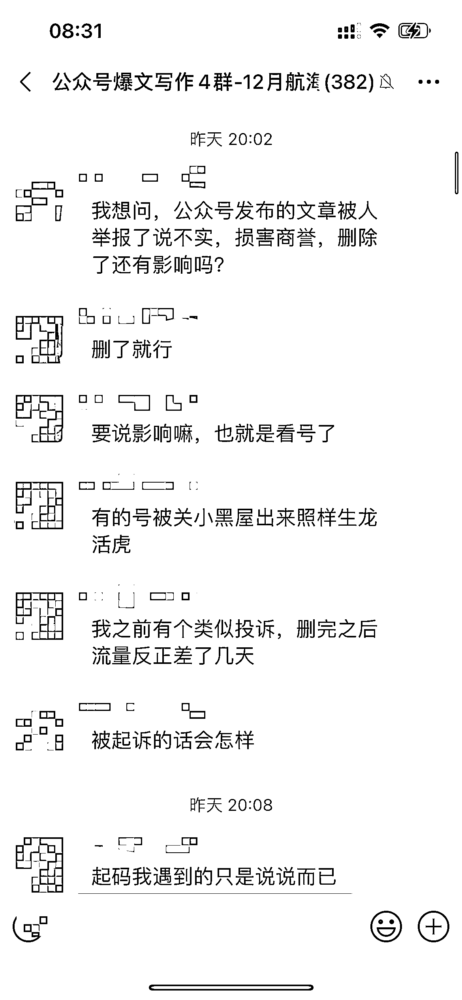
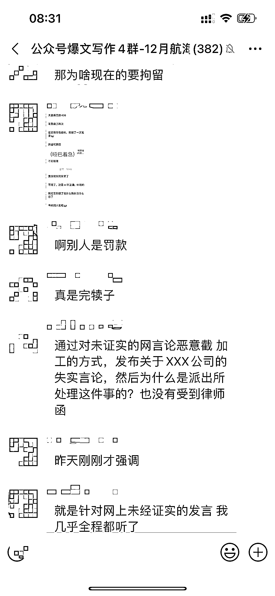
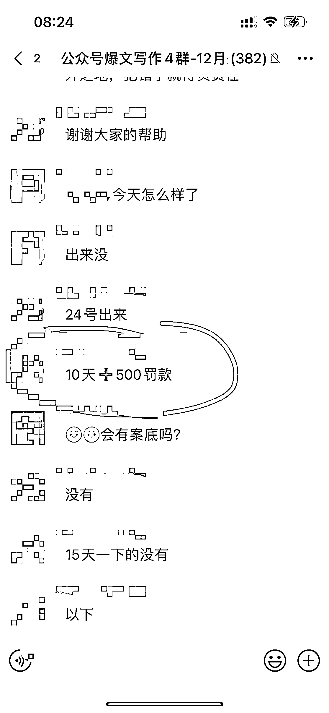

# 公众号发布不实信息，被起诉并罚款 500 元

> 原文：[`www.yuque.com/for_lazy/xkrm14/yz1fwo4ymgvon35l`](https://www.yuque.com/for_lazy/xkrm14/yz1fwo4ymgvon35l)

作者： 北辰

日期：2024-03-15

点赞数：**68**

* * *

正文：

公众号切勿发布“不实信息”。
有圈友因发布“未经证实”的消息，被文中涉及的公司起诉，删文也无效，帽子叔叔跨省上门，最终结果是 10 天+500¥。文章阅读量 10W+，消息来源是某脉职场 app 内该公司认证员工发布，涉及的公司有 GJ 背景。
此次事件警示我们，避免明牌涉及某个具体的公司，特别是有国资背景的。撰写的内容最好是由官媒发布的。

* * *

评论区：

Denggh : 大概率写的是那些裁员降薪的吧

北辰 : 你是懂行的~

Denggh : 公司最忌讳损害名誉，这种负面信息慎重写

华龙 : 写那种工资和年终奖会不会，我还打算写这个呢？

Denggh : 别点名公司就行，有的公司会介意，文章一旦爆了，容易惹麻烦

华龙 : 啊，这个按理说不算负面吧。

Denggh : 除非你通篇文章都是夸，你写它的薪资，你能拿到真实证据么，如果不能，它就会举报你发布不实信息，侵权

* * *

公众号懒人搜索，懒人专属群分享