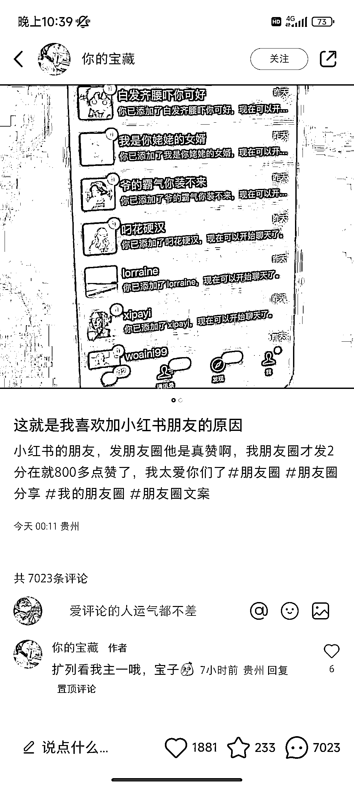
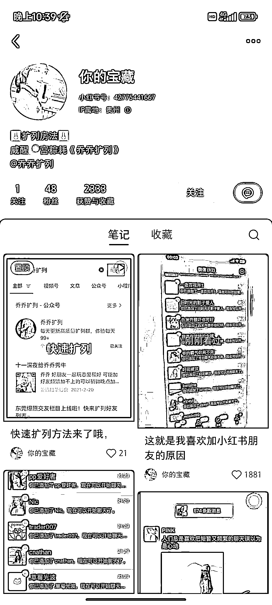
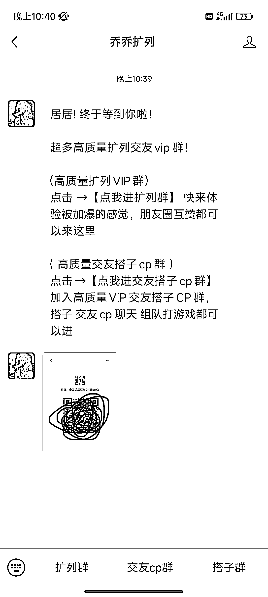
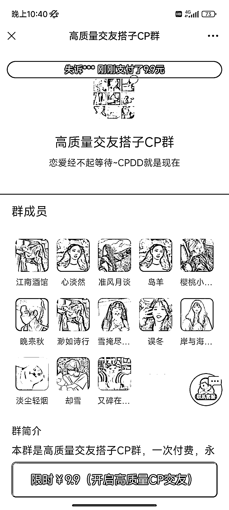

# 小红书引流到微信扩列玩法，打造私域变现的新途径

> 原文：[`www.yuque.com/for_lazy/xkrm14/lqfyhgbv0dww6vpf`](https://www.yuque.com/for_lazy/xkrm14/lqfyhgbv0dww6vpf)

作者： 饼干哥哥🍪

日期：2024-03-13

点赞数：**83**

* * *

正文：

小红书引流到微信扩列玩法 小红书笔记➕公众号➕自动收款工具发群二维码 1\. 小红书发朋友圈点赞或者活跃的截图， 找小程序制作 2\. 视频笔记置顶：
教你怎么找到公众号点菜单 3\. 公众号弹出二维码， 扫码后进入付费加群的页面 4\. 变现方式： 付费相亲群
这种方式还适合引流到私域做朋友圈运营变现的其他产品

* * *

评论区：

猎鲸者 : 微信群如何设置付费加群的，厉害

饼干哥哥🍪 : 是一个第三方网页 付款后就会弹出来群聊二维码

Lic : 我当初做过一段，变现及其差，弄得我好几个微信都是大几千的这种泛粉，又没法做别的用，最后搞得没办法，注销重新养微信了[流泪]

艾兜兜儿 : 有经验[强]

文轩 : 害，没找对人吧

饼干哥哥🍪 : 🎊哇第一次谢谢

* * *

公众号懒人搜索，懒人专属群分享