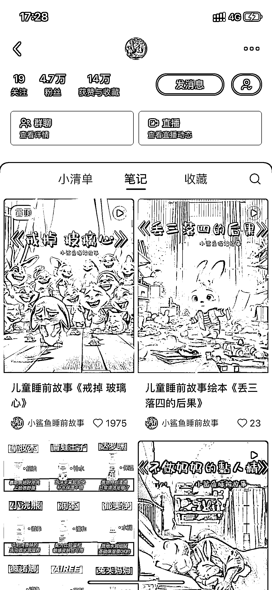

# AI 睡前故事赛道，简单复制吸粉 4.7w，已卖出 400 单

> 原文：[`www.yuque.com/for_lazy/xkrm14/grsbs1b6ps4m25kx`](https://www.yuque.com/for_lazy/xkrm14/grsbs1b6ps4m25kx)

作者： Bernie Fu

日期：2024-03-12

点赞数：**168**

* * *

正文：

AI 睡前故事赛道，1/31 号发第一条内容，一个半月吸粉 4.7w，视频内容为 AI 生成的图片+AI 配音，非常简单好复制，通过小红书店铺分销带货，已卖出 400 单，同时还接付费推广笔记，后续还可以引流到私域做儿童教育课程付费，可玩性很高。

* * *

评论区：

加林 : 这个人物和背景分离的效果是咋做出来的

米斯特 LIu : MJ 吧

为了理想而奋斗~ : 这是怎么搞了呀，大佬

* * *

公众号懒人搜索，懒人专属群分享