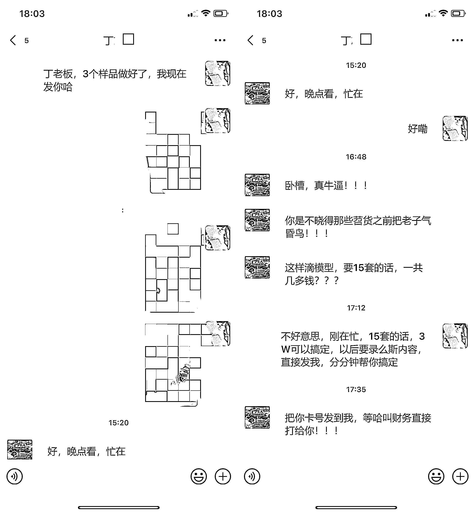

# 3 万元开启 4S 店销售新纪元，数字人如何重塑汽车营销？

> 原文：[`www.yuque.com/for_lazy/xkrm14/wnmuh7no8zl30gg4`](https://www.yuque.com/for_lazy/xkrm14/wnmuh7no8zl30gg4)

作者： PONY

日期：2024-03-11

点赞数：**53**

* * *

正文：

3 万元开启 4S 店销售新纪元，数字人如何重塑汽车营销？
在这个快节奏的互联网时代，短视频成为连接商家和消费者的重要桥梁。然而，传统的视频制作不仅耗时耗力，更重要的是，有时还难以准确传递商家的意图——特别是在高度竞争的汽车销售行业中。
我的一个球友，一家知名汽车 4S 店的老板，深有体会。尽管店内聘请了形象气质出众的销售人员，但在制作用于抖音等短视频平台的宣传视频时，他们在产品展示和口头表达方面的表现远远低于预期。每次拍摄都需要投入大量的时间和成本，而成果往往不尽人意。
就在他几近绝望之时，我的一条朋友圈内容——我提供的数字人商家私人定制服务——吸引了他的注意。想象一下，一个能够流畅表达、永远不疲惫、完美展示每一款汽车亮点的数字人，这不正是他一直在寻找的解决方案吗？
决定尝试之后，我迅速行动，为他制作了三套数字人样品短视频。结果令人震惊——不仅效果惊人，与真人销售相比，这些数字人销售的表现稳定且无可挑剔，大大节省了时间和成本。
球友激动地表示，今年的汽车销售将全面采用我的数字人技术。他之前所遭受的困扰，如今终于得到了解决。这次合作，我为他定制了 15 个不同的汽车销售模型，以成交价 3 万元的价格，开启了双方的合作之路。
这个案例不仅是我技术实力的证明，更是数字人在汽车销售领域应用潜力的一次展示。我相信，随着技术的进步和应用场景的拓展，数字人将在更多行业发挥其独特的价值，帮助商家以更低的成本实现更高的营销效果。
在这个变革的时代，AI 正在引领一场销售和营销的革命。让我们一起拥抱变化，迎接数字人带来的无限可能。

* * *

评论区：

* * *

公众号懒人搜索，懒人专属群分享