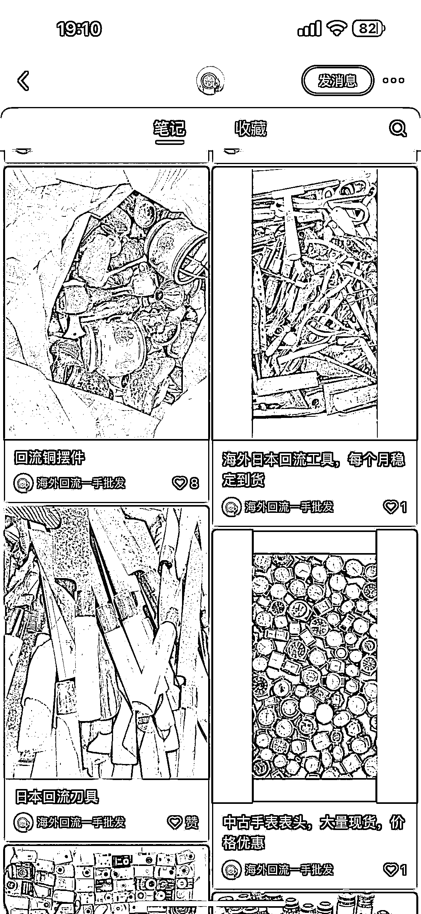
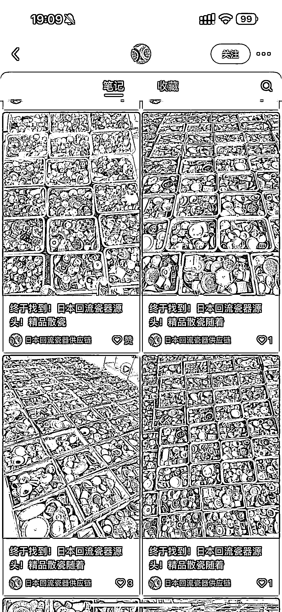
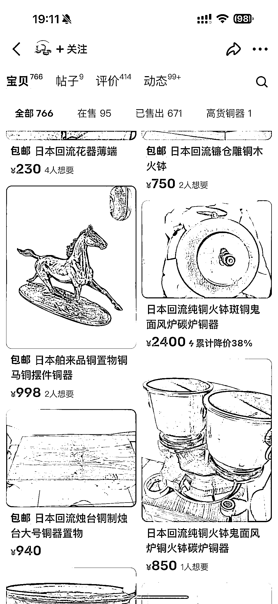
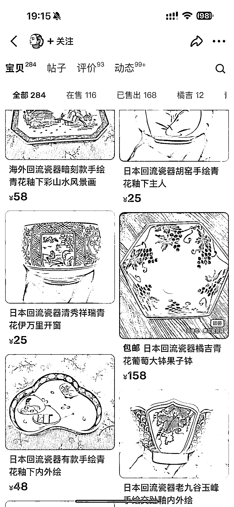

# 日本中古市场：散瓷、铜器、工具、精品瓷器、精品铁器价格一览

> 原文：[`www.yuque.com/for_lazy/xkrm14/qebipcumo2zfinnq`](https://www.yuque.com/for_lazy/xkrm14/qebipcumo2zfinnq)

作者： 老薛

日期：2024-03-15

点赞数：**134**

* * *

正文：

关键词，日本中古，日本铜器，日本铁器，中古市场 散瓷 1.6 万/吨 铜器 6.5 万/吨 工具 8500/吨 精品瓷器 2.5 万/吨 精品铁器 3 万/吨
垃圾批发回来后分拣后拍照，(底款好的有故事的，说明清晰)或者放闲鱼，起步 10 倍利润。私域更香。客户回购率百分 95.

* * *

评论区：

修之 : 有项目拆解吗？

老薛 : 已经这么明确了，还需要拆解吗？月入 50 万大有人在，

修之 : 实在抱歉，打扰了。

Strong : 21 年接触这个项目，去大连考察了一圈，结果回来干家纺厂。。干倒之后，又刷到了这个生财的瓷器标

老薛 : 思路定位清晰了，只要想干，什么时候也不晚

企业信用修复渠道对接 : 中打标了

文子 : 货源怎么找呢

* * *

公众号懒人搜索，懒人专属群分享