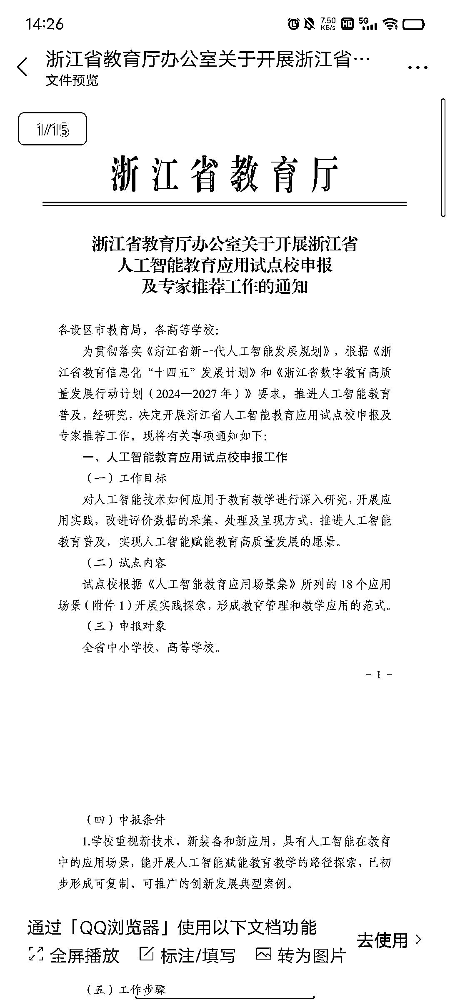

# 浙江省教育局合作，开启人工智能教育试点校申报，18 个应用场景引发机会

> 原文：[`www.yuque.com/for_lazy/xkrm14/oskbmhdg4q8x4trk`](https://www.yuque.com/for_lazy/xkrm14/oskbmhdg4q8x4trk)

作者： 胖虎

日期：2024-03-12

点赞数：**108**

* * *

正文：

目前我跟浙江省的教育局合作较多，集成数字化和人工智能相关软硬件产品。
前段时间沟通中，得到的信息：浙江省教育厅发布文件，基于新型的人工智能教育应用场景，让浙江的中小学去申报试点校。 其中提到了 18 个应用场景，非常震撼！
这样的相关产品，大部分市面上没有，有很多机会。

* * *

评论区：

袁六伟 : 牛逼

胖虎 : [耶][耶]

Northrp : 有所耳闻 宁波这边有个实验室现在也在开发阅卷的人工智能 目标是以后的高考阅卷也用人工智能

* * *

公众号懒人搜索，懒人专属群分享